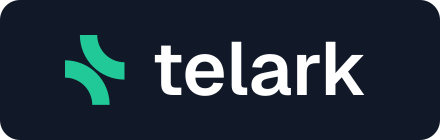

<p align="center">
  
</p>

<h3 align="center">Change control for Kubernetes applications</h3>

<p align="center">
  Freeze the apps that matter while you ship, see every change that reached them,<br>
  and find out why one broke. Self-hosted, in your cluster.
</p>

<p align="center">
  <a href="docs/getting-started.md"><b>Get started</b></a> ·
  <a href="docs/">Docs</a> ·
  <a href="https://telark.io">Website</a> ·
  <a href="https://github.com/telark/telark/discussions">Discussions</a>
</p>

<p align="center">
  <a href="https://github.com/telark/telark/actions/workflows/ci.yaml"></a>
  <a href="https://github.com/telark/telark/releases"></a>
  
  <a href="LICENSE.md"></a>
</p>

<!-- Add a dashboard screenshot here once published: docs/assets/dashboard.png -->

> [!NOTE]
> Early access. The API is `v1alpha1` and may change before 1.0. Pin a chart version.

## The problem

In a shared cluster, anyone with access can change a critical application at any time. Kubernetes RBAC decides *who* may change something, not *when*: it cannot say "nobody touches checkout between 22:00 and 02:00 tonight". So change freezes run on a chat message and good intentions, and one `kubectl delete`, scale-down or image swap in the middle of a release becomes an incident.

When that incident starts, the first question is "what changed?". Answering it means reading events, rollout history and pod status across several workloads while the app is down.

## What Telark does

Telark groups your workloads into applications and gives each one change control:

| You want to | Telark gives you |
|---|---|
| Keep an app stable during a release, maintenance window or audit | **Protection plans**: block chosen changes (deletion, scaling, image, config and Secret edits, storage) for an app or namespace, for a time window. Audit first, enforce when ready. Require approval when it matters; Production does by default. |
| Know the protection is really in place | Plan health checked against the live cluster, every blocked or audited change listed as a violation, and a report when the plan ends. |
| Find out what changed and undo it | A field-level history of every change to an application, deletions included, with snapshots you can roll back to. |
| Understand an incident without digging | **Insights**: one card per affected workload with the likely cause, the evidence and the change it followed, plus a review of each app's setup. |
| Decide who may do what | Passkeys or Google SSO, roles per area, and per-action deny rules such as "may edit plans, may not approve them". |

Everything is enforced at admission by Kyverno, which ships with the chart. You work in a dashboard, not in policy YAML.

### Insights: decision support, not autopilot

When an application degrades, Telark reads its events, pod status and recent changes and writes one card per affected workload: crash loop, out of memory, image pull failure, scheduling, failing probes, stuck rollout, or a regression that started right after a config change. Each card cites the evidence and the change it followed, and it resolves itself when the workload recovers.

It also reviews every application's setup against 60 rules (reliability, resources, scaling, security, images, config, networking, change risk, protection, consistency) and lists what to fix, such as a single replica with no disruption budget in production.

How it stays trustworthy:

- Findings come from deterministic rules. A small open-weight model only rewrites their wording, and Telark discards any rewrite that drops or invents a fact.
- It is read-only. It never changes your cluster.
- The model runs in your cluster through Ollama. No data leaves it, no API key is needed, and it works air-gapped.
- It is on by default and easy to switch off in Settings. Setup reviews run on their own; incident analysis runs when you click Analyze, or automatically once you enable auto-analyze. The rest of Telark works without it.

## Quick start

You need Kubernetes 1.30+, Helm 3, and a ReadWriteMany StorageClass (`efs-sc` on EKS). On a single-node cluster, add `--set app.singleNode=true` and any class works.

```sh
helm install telark oci://ghcr.io/telark/charts/telark -n telark --create-namespace \
  --set app.persistence.storageClass=<rwx-class> \
  --set 'app.auth.bootstrap.admins={you@example.com}'
```

Enrol yourself as the first admin and open the dashboard:

```sh
kubectl exec -n telark deploy/telark-auth-service -- ./main break-glass --email you@example.com --enroll
kubectl port-forward -n telark svc/telark-ui-service 3000:8080
# open http://localhost:3000/register?enroll=<token printed above>
```

From there: your applications appear on their own; create a protection plan in audit mode to see what it would block. The [getting started guide](docs/getting-started.md) walks through it in about ten minutes.

## Documentation

| | |
|---|---|
| [Getting started](docs/getting-started.md) | Install, first login, first protection plan |
| [Concepts](docs/concepts.md) | Applications, protection plans, insights, access control |
| [Install and configure](docs/INSTALL.md) | Sizing, exposure, SSO, networking, upgrades, uninstall |
| [Chart values](charts/telark/VALUES.md) | Every configurable value |
| [Custom resources](docs/CRDS.md) | The `telark.io` API |
| [Architecture](docs/architecture.md) | Services and data flow |
| [Security model](docs/security/README.md) | Authentication, authorization, trust boundaries |

## Compatibility

Kubernetes 1.30 or newer; 1.33+ is the tested target. Only GA Kubernetes APIs are used. Runs on EKS, GKE, AKS and OpenShift. The chart bundles Kyverno, Redis, NATS, metrics-server and Ollama.

## Community

Questions and ideas go to [Discussions](https://github.com/telark/telark/discussions), bugs to [Issues](https://github.com/telark/telark/issues). To contribute, start with [CONTRIBUTING.md](CONTRIBUTING.md). Report vulnerabilities privately as described in [SECURITY.md](SECURITY.md).

## License

Source-available under the [Elastic License 2.0](LICENSE.md). You may use, modify and self-host Telark; you may not offer it to others as a managed service.
