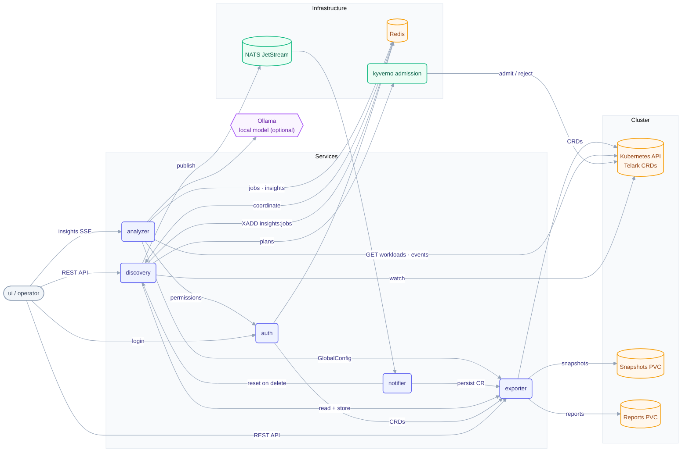

# Architecture

telark is a control plane for **protection plans** over Kubernetes workloads: discover applications, bind policy templates to a scope and a window, decide what may change them at admission, and verify the running state against the cluster.

## System

Each service's own README carries a focused diagram of its internals: [auth](../services/auth/README.md) · [discovery](../services/discovery/README.md) · [exporter](../services/exporter/README.md) · [analyzer](../services/analyzer/README.md) · [notifier](../services/notifier/README.md).

## Services

| Service | Language | Responsibility |
|---|---|---|
| `exporter` | Go | Owns the CRDs and storage; seeds built-in resources; stores workload snapshots and plan reports on its volumes. The only stateful service. |
| `discovery` | Go | Groups workloads into applications; runs the leader-elected reconcile loop; drives protection-plan lifecycle, approvals and reports. |
| `analyzer` | Python / FastAPI | Local analyzer: investigates incidents with a local model over read-only cluster tools; writes findings to Redis; streams updates to the UI (SSE). |
| `auth` | Go | Passkey (WebAuthn) + Google OIDC login; session and role reconciliation. |
| `notifier` | Go | Consumes discovery's application events from NATS and upserts the `ApplicationAsResource` CRs through `exporter`. |
| `ui` | — | Dashboard SPA (separate repo; the chart ships only the image reference). |

## Shared infrastructure (subcharts)

`redis` (coordination, queues, dedup), `nats` (messaging), `kyverno` (admission policy engine), `metrics-server` (HPAs / `kubectl top`), `vpa` (optional, `vpa.enabled`), `ollama` (the analyzer's model runtime, on by default; `app.ollama.enabled=false` skips it).

## Data flow (high level)

1. `discovery` watches workloads, groups them into applications and publishes each change as `telark.applications.update` on NATS; `notifier` upserts the `ApplicationAsResource` through `exporter`, which writes every telark custom resource.
2. When a change is an incident or a recovery, `discovery` appends an analysis job to the Redis stream `insights:jobs`.
3. `analyzer` (when enabled) consumes the job, investigates with a local model over read-only tools, writes the findings to Redis and streams updates to the UI; the UI reads the insights through `discovery`.
4. Protection plans transition `pending_approval → scheduled → active → terminated` (the approval step only when the plan requires it); while active, admission policies are deployed for the scope minus its exclusions, and their health is verified against live cluster state. `discovery` renders plan reports and `exporter` stores them on the reports volume.
5. `auth` authenticates operators (passkey/OIDC) and reconciles role custom resources. Each route is gated by the caller's role on its scope, and a custom role can withhold single actions with deny rules (see the [discovery](../services/discovery/README.md#api) and [exporter](../services/exporter/README.md#api) READMEs).

## Identity

The app identity is a single value, `app.name` (default `telark`), shared by both charts and hardcoded in the API groups the Go services watch (`erpi.telark`, `auth.telark`, `classification.telark`). See [ADR 0002](adr/0002-app-name-is-the-identity-source-of-truth.md).

## Deeper references

- [Components and flows](architecture/README.md): call graph, Redis and NATS usage, startup, flows
- [Protection plans](architecture/protection-plans.md): lifecycle, policies, violations, reports
- [Security model](security/README.md): authentication, authorization, RBAC, invariants
- [Testing and validation](testing/README.md)
- [Analyzer architecture](../services/analyzer/ARCHITECTURE.md)
- [OIDC / SSO architecture](../services/auth/OIDC.md)
