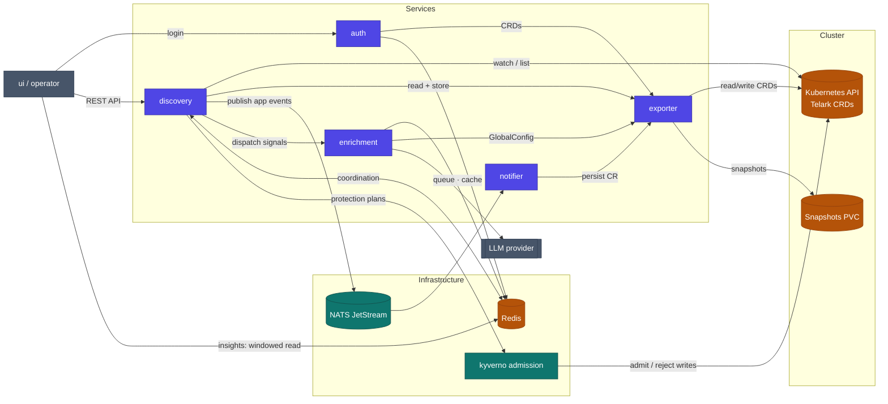

# Architecture

telark is a control plane for **protection plans** over Kubernetes workloads: discover applications, bind policy templates to a scope and a window, decide what may change them at admission, and verify the running state against the cluster.

## System

Each service's own README carries a focused diagram of its internals: [auth](../services/auth/README.md) · [discovery](../services/discovery/README.md) · [exporter](../services/exporter/README.md) · [enrichment](../services/enrichment/README.md) · [notifier](../services/notifier/README.md).

## Services

| Service | Language | Responsibility |
|---|---|---|
| `exporter` | Go | Owns the CRDs and storage; seeds built-in resources; snapshots cluster state. The only stateful service. |
| `discovery` | Go | Groups workloads into applications; runs the leader-elected reconcile loop; dispatches enrichment; drives protection-plan lifecycle. |
| `enrichment` | Python / FastAPI | Generates AI insights for applications; provider-pluggable (groq, gemini, ollama, anthropic). |
| `auth` | Go | Passkey (WebAuthn) + Google OIDC login; session and role reconciliation. |
| `notifier` | Go | Notifications. |
| `ui` | — | Dashboard SPA (separate repo; the chart ships only the image reference). |

## Shared infrastructure (subcharts)

`redis` (coordination, queues, dedup), `nats` (messaging), `kyverno` (admission policy engine), `metrics-server` (HPAs / `kubectl top`), `ollama` (optional local LLM).

## Data flow (high level)

1. `exporter` watches the cluster and materializes telark custom resources (applications, groups, roles…).
2. `discovery`'s leader groups workloads into applications and, on a tick, dispatches application signals to `enrichment`.
3. `enrichment` calls the configured LLM and writes insights back; the UI polls a windowed read.
4. Protection plans transition `scheduled → active → terminated`; while active, admission policies are deployed and their health is verified against live cluster state.
5. `auth` authenticates operators (passkey/OIDC) and reconciles role custom resources.

## Identity

The app identity is a single value, `app.name` (default `telark`), shared by both charts and hardcoded in the API groups the Go services watch (`erpi.telark`, `auth.telark`, `classification.telark`). See [ADR 0002](adr/0002-app-name-is-the-identity-source-of-truth.md).

## Deeper references

- [Enrichment architecture](../ENRICHMENT-ARCHITECTURE.md)
- [OIDC architecture](../OIDC-ARCHITECTURE.md)
