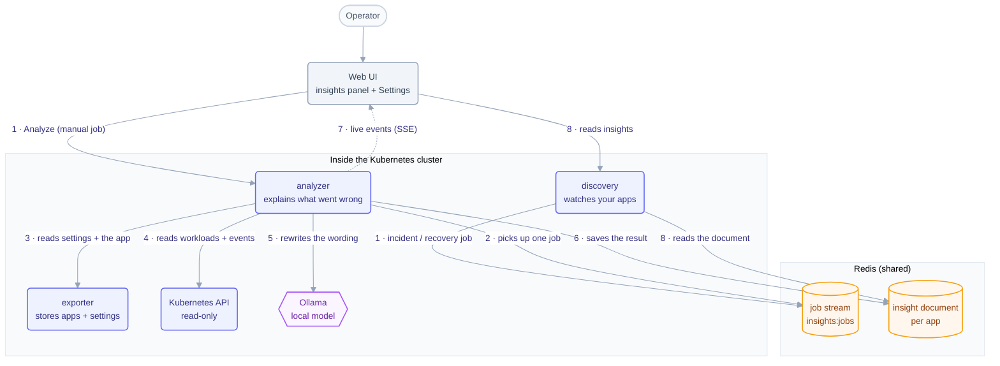

# Local analyzer — How it works

Telark analyzes an application when something goes wrong with it. Detection rules
decide what is wrong; a small free model that runs inside the cluster only rewrites
the wording. This is a simple map of the pieces and the order things happen in.

## Step by step

1. A job is added to the Redis stream `insights:jobs`. Discovery adds one when an
   app records an **incident** or a **recovery**; the **Analyze** button adds a
   **manual** one. There is no timer.
2. The analyzer's single worker picks up one job at a time. It skips jobs that are
   too old (30 min), already running, still cooling down, or automatic while
   `autoAnalyze` is off, and records why on the app's document. A job that finds a
   background review of its app waits for it to finish (at most 20 s).
3. It reads the analyzer settings (enabled, model, autoAnalyze, excluded
   namespaces) and the application from exporter-service.
4. It reads the app with four read-only tools (app overview, change history,
   recent warning events, the status of up to three workloads), within fixed caps.
5. Detection rules turn what it read into at most three insights (crash loop, out of
   memory, image pull, scheduling, probes, evictions, stuck rollout, a regression
   after a recent change), each citing the evidence it rests on. Telark's own code
   merges them with the previous ones (same workload in the same namespace = same card; resolved cards
   reopen; nothing resolves just because a run stayed silent) and saves the document:
   the cards are visible within a second or two.
6. If the model is ready, one short call asks it to reword each card's title and
   summary from the same facts. It cannot change anything else; if it is slow, busy,
   missing or wrong, the rule wording stays. The document is saved again with the run
   marked done.
7. Each step is pushed to open browser tabs as a live event.
8. The UI then re-reads the document through discovery-service, which serves it
   even while the analyzer is off or absent.

A **recovery** job resolves the open insights directly, without asking the model.

After a run has saved its result, the analyzer also **reviews the app's setup**: it reads
the workloads and their pods, the Services, disruption budgets, autoscalers and network
policies of the app's namespaces and the protection plans, and checks 60 fixed rules
(single replica, no probes, missing requests, privileged containers, moving image tags,
a Service that selects nothing, a production app without a protection plan, …). Each
finding is saved as a **recommendation** card in the same document, never reworded by
the model. A slow background sweep reviews the other apps too (changed apps first, then
each one every two hours), pausing whenever analysis jobs are waiting. A rule only
creates or resolves a card when everything it needs was read completely; a workload the
cluster answers "not found" for counts as deleted, so its cards resolve. Operators can
acknowledge a card, dismiss a recommendation or reopen it.

**Deep mode** (`ANALYZER_MODE=deep`, for 4+ vCPU or a GPU) instead gives the model the
four tools, lets it investigate for a few steps and asks it for the insights; the
same code checks and merges them. On a small CPU node this takes minutes.

## Notes for developers

- **Redis is shared** by discovery and the analyzer on **DB 0** (auth uses DB 1).
  The stream is `insights:jobs` (group `analyzer`); each app's document is
  `analyzer:<namespace>:<name>` (TTL 7 days; every review and triage write bumps its
  `version`); in-flight and cooldown keys use the
  `analyzer:inflight:` and `analyzer:cooldown:{manual,auto}:` prefixes.
- **The contract is frozen in Go** (`internal/data/insights`,
  `internal/data/resources/application/insights.go`, `internal/rest/endpoints/insights`);
  `constants.py` and `models.py` mirror it with identical names.
- **exporter-service is the only service that reads/writes cluster config** (the
  `GlobalConfig` CR). The analyzer reads it through exporter with the service
  token, never from environment variables.
- **Read-only by construction**: the tools and the review only issue `GET`s, and the
  analyzer's RBAC grants get/list on pods, events, workloads, Services,
  PodDisruptionBudgets, HorizontalPodAutoscalers and NetworkPolicies, nothing else
  (never ConfigMap or Secret contents).
- **Keys the review adds**: `analyzer:index` (ZSET, member `<ns>/<name>`, score = last
  document write in unix ms, written after the document, removed after it), `analyzer:usage`
  (hash, per app: ≤ 48 usage samples per workload) and `analyzer:review` (hash, per app:
  `<generation>:<epoch>` of its last review). The sweep removes all three for a deleted app.
- **Zero impact when off**: discovery only appends to the stream (errors are
  logged) and keeps serving the last document; readiness depends on Redis only,
  never on the model runtime.
- **One replica, one event loop**: every document write goes through one
  in-process lock; running more replicas needs a Redis lock instead.
