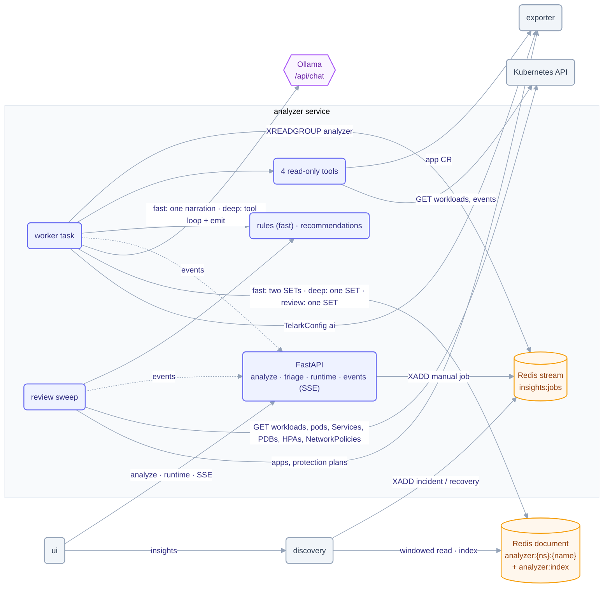

# analyzer service

The analyzer powers Telark's Insights page. It explains why an application is unhealthy and
reviews each application's setup, reading the cluster read-only and running a free, open-weight
model through Ollama in the cluster (no provider, no API key). This README is for contributors
and operators tuning it; the user-level overview is in [Concepts](../../docs/concepts.md#insights).

One asyncio worker task
consumes analysis jobs from a Redis stream, reads the app with four typed, capped, read-only
tools, and writes one document per app that the Insights page reads. In the default **fast**
mode deterministic rules decide every insight and the model only rewrites its title and
summary; the opt-in **deep** mode lets the model investigate with the tools. After every run,
and on a slow in-process sweep, a **setup review** evaluates 60 deterministic recommendation
rules (never the model). Telark code (not the model) owns ids, timestamps, validation, the
insight lifecycle and persistence. When the analyzer is disabled, absent or failing, core
Telark is unaffected: discovery only appends to the stream and keeps serving the last document.

## Architecture



## Flow

1. Jobs arrive on the Redis stream `insights:jobs` (consumer group `analyzer`): discovery appends an
   `incident` or `recovery` job when a publish authored one, and `POST …/analyze` appends a `manual` job.
2. The worker task reads one job at a time. It drops stale (older than 30 min), in-flight, cooled-down
   and, for automatic triggers, `autoAnalyze=false` jobs; only a dropped manual run is recorded on the
   document. A job whose app a sweep review holds waits for the review (at most 20 s) instead of being
   dropped. An `incident` job re-reads the Application (3 reads, 1 s apart) until its `history.generation`
   reaches the job's: discovery enqueues the job before exporter holds the entry that triggered it.
3. A `recovery` job resolves every open insight in code, with no model call.
4. Otherwise the run follows `ANALYZER_MODE` (see [How a run works](#how-a-run-works)).
5. Code validates every insight against what the tools returned this run, merges it into the document
   (dedup id, reopen, code-only resolve, 7-day prune) and writes it with `SET` (TTL 7 days, `version`
   incremented on every write; a new or lost document starts from the clock in unix ms, so a rebuilt one
   never drops below a version an open panel holds). One card per workload: the id hashes the app, the workload's kind and
   name and its namespace, so an app that runs `web` in two namespaces gets a card for each; every card
   names its workload's namespace in `params.namespace` (deep mode: the first app namespace that runs
   the workload). A card written before the id named the namespace moves to the new id the next time
   its incident fires, keeping its history; one that does not fire again resolves as usual. A card
   whose namespace is excluded after it was written resolves on the app's next untruncated run, and so
   does one whose workload's status read answers 404 (deleted, while the Application still lists it).
6. Every step publishes an event to the in-process broadcaster; the SSE endpoint relays it, and the UI
   refetches the document through discovery whenever an event carries a newer `version`. A setup review
   ends with `review.finished {version}`, since its write moves `lastReviewAt` even when no card changes.

## How a run works

**fast** (default, seconds on 2 vCPU): gather → rules → write → narrate → write.

1. **Gather** (≈ 1 s): the worker calls the tools itself: overview, change history (5), warning events of
   the last 60 min, then the status of at most 3 workloads (those named by events first).
2. **Rules** (`rules.py`, ms): one candidate per workload, by precedence `oom` > `image_pull` >
   `crashloop` > `scheduling` > `probe_failure` > `resource_pressure` > `rollout_stuck` >
   `config_change_regression` > `other`, at most 3 per run, with evidence refs and template prose. A workload
   with no replica ready (of at least one wanted) is critical whatever the kind. A paused Deployment is no
   incident unless its pods show a symptom (the `reliability.deployment_paused` recommendation says it is
   paused), and pausing resolves its open `rollout_stuck`, `config_change_regression` and `other` cards on the
   next run (the shortfall is intentional); a pod-symptom card (`crashloop`, `oom`, …) still waits for every
   replica. Pods that cannot create their container or mount a volume keep their `other.*` cause after the
   rollout deadline. The newest incident, or rollout (`deployment`), `config` or `resources` change, in the last 30 min
   and no later than 1 min after the incident's start (a change made after it began is never its cause), nor newer
   than the app's newest incident entry when no recovery followed it (an edit made during an outage, even one
   whose new pods date the symptom, did not cause it), is cited as
   `gen:<n>` and in the summary, naming its first field other than discovery's synthetic `health` (an entry
   with only `health`, such as the one for an app first seen down, is no change and is never cited); "N min
   after change" is measured to the incident's start (its earliest matched event), or to the run when no
   event dates it; an incident job whose change exporter still lacks after the re-reads cites none rather
   than an older one.
   Events of a pod that no longer exists (a replaced pod's leftover) and a `FailedScheduling` event whose
   pod has a node since are history, whatever the workload's readiness. On a fully ready workload, events
   that precede their pod's current Ready state are history too: they raise no card, date no incident and
   do not block the resolve.
   A pod with a restarted container that has run for less than 60 s has not recovered yet: a crash loop's
   container is Ready for the seconds it runs between two back-offs, so its events still count.
3. **First write**: the cards are merged and announced (`insight.created` / `insight.updated`); `lastRun`
   is still `running`.
4. **Narrate**: only when the runtime is `ready` and there are cards, one `/api/chat` call with no tools and
   a JSON schema (one `title` ≤ 80 / `summary` ≤ 240 per card, in order), `ANALYZER_NARRATE_TIMEOUT_SEC`.
   The model polishes each card's template title/summary (sent with its facts). A rewrite is kept only
   when its title names the workload exactly, it keeps every value the template states (pod, image,
   exit code, restarts, …), adds no markup and no pod/image-like name absent from the facts, and was not
   cut at the schema's length cap.
   Any failure (timeout, busy, any Ollama error, bad JSON, wrong item count, empty or unfaithful text)
   keeps the template prose. A runtime that is not ready is asked for the model (auto-pull) and skipped.
5. **Second write**: the narrated `title`/`summary` (nothing else), the observed resolves and
   `lastRun done`, then `insight.updated` for rewritten cards, `insight.resolved` and exactly one
   `analysis.finished`. `lastRun.steps` is 1 when the narration was applied, 0 for rules only;
   `toolCalls` counts the gather reads. A fast run never fails for the model.

**deep** (`ANALYZER_MODE=deep`, ≥ 4 vCPU or a GPU): the worker checks the runtime (a run fails when it is
not `ready`), then runs the native Ollama `/api/chat` tool loop (at most 8 steps and 8 tool calls, a
per-request context fit check, a 480 s wall with an emit reserve) and one EMIT call constrained by a JSON
schema (at most 3 insights). One write, one `analysis.finished`. Minutes on a small CPU node.

Every request sets `options.num_thread` (`ANALYZER_NUM_THREAD`), `num_ctx` (`ANALYZER_CONTEXT_TOKENS`)
and `keep_alive: -1`. Each fast run logs one line with no namespace or name:

```text
run <runId> timings: gather=0.4s rules=0.001s narrate=5.2s total=5.7s narrated=True reason=
```

`reason` is why nothing was narrated: the runtime state (`model_missing`, `pulling`, …), the exception
class (`OllamaTimeout`, `OllamaError`, `ValidationError`, …), `item_count` or `unfaithful` (every
rewrite was rejected).

> Full walkthrough: **[ARCHITECTURE.md](ARCHITECTURE.md)**.

## Messages

The rules decide each incident's **kind** and a **sub-reason** (`reason`, 52 codes such as
`image_pull.not_found`, `crashloop.exit_127`, `probe_failure.readiness`) from the pod status, the
untruncated event text (the model sees 160 characters; containerd puts the cause after that) and the
spec limits, plus a small `params` map (workload, pod, container, image, registry, exit code,
ready/desired, probe, failure, port, …; at most 16 keys of at most 120 characters, secret values never,
and never the output of an exec probe). The server renders the **title** (`{workload} is down: image
not found`) and the **summary** (impact sentence, one factual detail, the change correlation) from
per-reason templates in `constants.py`; the UI renders the cause and the steps from the same `reason`
and `params`. A rules-only card is complete; the narration may only rephrase title and summary, and is
rejected when it adds a number, drops the sub-reason's phrase or names another kind's symptom
(`out of memory`, `pull`, `crash`, `evict`, `schedul`, `probe`, `rollout`, `quota`, …).

Behaviour change: a liveness or startup probe failure that already restarted a container is reported
as `crashloop` (`crashloop.probe_kill`); `probe_failure.liveness`/`startup` apply only while no
container has restarted. The card id is unchanged (per workload); the kind updates on the next run.

## Recommendations

A **setup review** reads the app read-only and evaluates 60 deterministic rules in 10 families
(`reliability`, `resources`, `scaling`, `security`, `images`, `config`, `networking`, `change_risk`,
`protection`, `consistency`). Recommendations live in the same document as `category:
recommendation` cards (`kind` = family, `reason` = `<family>.<rule>`), one card per workload and rule
(the four usage rules: per container and resource), capped at the 40 most severe per app. A card
ranked past the cap is removed, not resolved (it is still true), and comes back once there is room; a
dismissed card takes no place under the cap. They are never narrated: the template text is exact.

- **When**: every analysis run reviews its app right after its final write (skipped while other jobs
  wait), and an in-process sweep reviews every `ANALYZER_REVIEW_TICK_SEC` the apps whose
  `history.generation` changed first, then those not reviewed for `ANALYZER_REVIEW_INTERVAL_SEC`, at
  most `ANALYZER_REVIEW_APPS_PER_MIN`. The sweep yields while jobs are queued, skips an app another
  run holds, and forgets an app absent from two consecutive app listings. `ANALYZER_REVIEW_INTERVAL_SEC=0`
  turns the sweep off (Analyze still reviews); nothing runs while `ai.enabled` is off.
- **Reads** (GET only): the workloads and their pods (reused from the run), four lists per app
  namespace (Services, PodDisruptionBudgets, HorizontalPodAutoscalers, NetworkPolicies, `limit=500`,
  shared across the apps of one tick), one pod probe per selector Service, the protection plans and
  plan environments from exporter. At most `ANALYZER_REVIEW_WORKLOADS_MAX` workloads (those with an
  incident first), 5 s per read, 20 s per review.
- **Accuracy**: each rule declares its input families; a failed, truncated or timed-out read leaves its
  family incomplete and its rules neither create nor resolve a card. A card resolves only when a complete
  review no longer finds it. A workload GET that answers 404 is not a failure: discovery keeps an
  Application's last resource list when its last workload is deleted, so the workload counts as gone and
  its cards resolve.
- **Usage rules** need the Application metrics (`metrics.workloads[].usage`, metrics-server): each review
  appends one sample (max over instances) to `analyzer:usage` (≤ 48 per workload); the rules use the p95
  of at least `ANALYZER_USAGE_MIN_SAMPLES` samples over `ANALYZER_USAGE_MIN_SPAN_SEC`.
- **Production**: an app is production when a namespace, or the environment of a protection plan that
  covers it, matches `ANALYZER_PRODUCTION_PATTERN`; that enables the protection rules. A workload is
  judged by its own namespace and the environments of the covering plans whose scope reaches it: that
  raises its `single_replica`/`no_pdb` to warning and enables digest pinning, so the dev namespace of an
  app that also runs in prod is not treated as production.
- **Lifecycle**: found → `open`; same facts → only `lastSeenAt` moves; new facts → `updated`; not found
  by a complete review, or about a namespace excluded since → `resolved` (kept 7 days); found again →
  reopened. Measurements that move with every sample (usage, samples, suggestion) refresh the text
  without making the card `updated`.
- **Triage** (`POST …/insights/{id}/triage`, `acknowledge` | `dismiss` | `reopen`, Contributor on
  insights): `dismiss` is for recommendations only and holds while the card's facts are unchanged; a
  change, a resolve or `reopen` clears it; acknowledging a resolved card or dismissing an incident is
  409 `invalid_triage`, an unknown id 404 `insight_not_found`. A triage that changes nothing is not
  written. It works whether the analyzer is enabled or not.
- **Index**: every document write also scores `<ns>/<name>` in the `analyzer:index` ZSET (last write,
  unix ms), after the document itself; a delete removes the document, then the member. Discovery's
  Insights page reads its rows from that index.

The review needs get/list on `services`, `policy/poddisruptionbudgets`,
`autoscaling/horizontalpodautoscalers` and `networking.k8s.io/networkpolicies` (the chart's analyzer
ClusterRole); without them those families stay incomplete. It logs one line per review, with no
namespace or name:

```text
review review-1790000000000 gets=13 findings=4 secs=0.41 incomplete=U
sweep due=12 reviewed=12 removed=0
```

Rollout order (the contract is additive, but discovery re-encodes the document): release
`internal/data` and `internal/rest` → discovery (pin bump) → analyzer → UI. An older discovery drops
the new fields and shows recommendations as incidents.

## Tools

Fast mode calls the four tools directly; deep mode gives them to the model. Arguments are validated by
pydantic models (`extra='forbid'`), a workload must belong to the app, and each result is cut to
`ANALYZER_TOOL_RESULT_MAX_BYTES`.

| Tool | Reads | Per-run cap |
|---|---|---|
| `get_app_overview` | the Application from exporter (health, namespaces, workloads, drift, last change, snapshots) | fetched once, repeats served from memory |
| `get_change_history` | the Application's change log, newest first | 2 |
| `get_workload_status` | one Deployment / StatefulSet / DaemonSet and its most-restarted pods; optional `namespace` for a workload the app runs in several (default: the first) | 3 |
| `get_recent_events` | recent events of the app's workloads and their pods (Warning only by default) | 2 |

**Read-only by construction:** there is no mutation tool and no workload-write RBAC anywhere. Kubernetes
calls are GET-only (`tools/k8s_tools.py` has a single `get` method, with the pod's service-account
token); the chart's ClusterRole grants only `get`/`list` on pods, events, deployments, statefulsets,
daemonsets and replicasets.

Caps (env names in [Configuration](#configuration)): `ANALYZER_MAX_STEPS` loop steps,
`ANALYZER_MAX_TOOL_CALLS` tool calls (at most 2 per step), `ANALYZER_TOOL_RESULT_MAX_BYTES` per result,
`ANALYZER_WALL_SEC` per run with a 300 s EMIT reserve, `ANALYZER_LOOP_TIMEOUT_SEC` /
`ANALYZER_EMIT_TIMEOUT_SEC` per model call, `ANALYZER_CONTEXT_TOKENS` × `ANALYZER_CHARS_PER_TOKEN` for
the fit check, at most 3 insights per run and 4 evidence refs per insight.

## Runtime states

`GET …/runtime` reports one of `absent` (no Ollama at `OLLAMA_HOST`), `unreachable`, `model_missing`,
`pulling` (with progress), `unsupported` (deep mode only: the model has no tool calling) or `ready`, plus
`mode` (`fast` | `deep`), `autoPull` and `enabled` (TelarkConfig `ai.enabled`, for users who may read insights
but not the settings). The state is re-checked every `ANALYZER_CONFIG_POLL_SEC` and pushed as `runtime.changed`
(same fields); readiness never depends on it. Fast mode needs only an installed model:
`validate` answers `model_lacks_tools` in deep mode only.

## Modes

- **Connected** (`OLLAMA_AUTO_PULL=true`, chart `app.ollama.autoPull=true`): while the analyzer is enabled, a
  missing model is pulled at the first config poll after start and by any run that needs it (the runtime needs
  443 egress for pulls only). A failing pull is retried every poll; only the first failure in a row is logged.
  Only models of the licence catalogue (`LICENSES` in `constants.py`) are pulled, and a pull still running
  after an hour is cancelled.
- **Air-gapped** (`OLLAMA_AUTO_PULL=false`): no pulls, the pull route answers 409 `auto_pull_disabled`; the
  model is pre-loaded on the runtime volume. Fast runs still deliver rule insights without it.
- **Your own runtime** (chart `app.ollama.runtimeUrl`, which sets `OLLAMA_HOST`): any endpoint that speaks
  the Ollama API, no key. Set `ANALYZER_NUM_THREAD` to that host's cores.

## Failures

| Failure | Behaviour (`lastRun.error`) |
|---|---|
| fast: model missing, pulling, runtime down, narration failed | run `done` with the rule cards (template prose, `steps` 0); a missing model is pulled when auto-pull is on |
| deep: Ollama down or absent | `runtime_unreachable`, job ACKed, worker backs off 15 s |
| deep: model missing / lacks tools | `model_not_installed` (pull starts when auto-pull is on) / `model_unsupported` |
| deep: model call timeout / Ollama busy twice | `model_timeout` / `busy`; nothing written |
| deep: context overflow | loop step: forced EMIT (low confidence); EMIT: `context_overflow` |
| deep: two bad tool-call steps / bad EMIT twice | `invalid_tool_calls` / `invalid_output` |
| Kubernetes tool timeout or error | the tool returns an error; the run is truncated (low confidence, no resolves). A 404 on a workload's status read is no truncation: the workload is gone and its card resolves |
| deep: loop or wall exhausted | forced truncated EMIT (low confidence, no resolves) |
| App deleted mid-run | `app_not_found`, document deleted |
| Stale, in-flight or dropped job | `job_expired` / `run_in_progress` / `job_dropped`, ACKed without a run; a sweep review holding the app is waited for up to 20 s first |
| Redis down | `storage_unavailable`; the API answers 503, ready fails |
| Anything unexpected | `internal_error` |

A `running` lastRun older than 540 s (crash mid-run) is shown as failed by the UI; the pending message is
reclaimed with `XAUTOCLAIM` on restart. The consumers past pods leave in the group are removed once idle for
an hour with nothing pending.

## Layout

| Module | Role |
|---|---|
| `main.py` | Entry point: one uvicorn server on one event loop; the lifespan starts the worker task, the config poll and the review sweep |
| `api_server.py` | FastAPI app: status probes, analyze, triage, runtime, runtime validate/pull, SSE events |
| `authz.py` | Session scope check through auth-service (plus the denyable-action rule) |
| `config.py` | Environment parsing (the only module that reads env) |
| `constants.py` | Every literal, including the frozen contract mirrored from `internal/data` and `internal/rest` |
| `models.py` | Pydantic mirrors of the Go contract (same JSON names) and the analyzer's own models |
| `helpers.py` | Redis key builders (Go `DocumentKey` format), time helpers, quantities, label selectors, image references, probe signatures |
| `exporter.py` | The only exporter client: TelarkConfig `ai` + `excludedNamespaces`, application reads, the app list, protection plans, plan environments |
| `insights.py` | Insight document store (document + `analyzer:index`), the incident and recommendation lifecycles, triage |
| `analyzer.py` | fast: gather + rules, narration; deep: tool loop, EMIT, fit check, wall/EMIT reserve, failure mapping |
| `rules.py` | Fast mode's detector: candidate insights from the tool results (pure) |
| `messages.py` | Incident sub-reasons and params, server title/summary templates, recommendation texts (pure) |
| `review.py` | The setup review's read-only gather with a completeness flag per input family, usage samples |
| `recommendations.py` | The 60 recommendation rules (pure) |
| `runtime.py` | Model runtime state (absent, unreachable, model_missing, pulling, unsupported, ready), mode, pull |
| `events.py` | In-process broadcaster: one bounded queue per SSE connection, `resync` on overflow |
| `tools/` | The four read-only tools, their argument schemas, caps and binding |
| `providers/ollama.py` | Ollama HTTP client (tags, show, chat, streaming pull) |
| `prompts/analyzer_prompt.py` | Deep: system prompt, user message, EMIT schema; fast: narration prompt and schema |
| `app_logger.py` | Log formatting |
| `tests/` | pytest suites (`test_*_cov.py` plus the named suites) and the shared `fakes.py` |

## Dependencies

- **Runtime:** Python 3.13+ (image ships 3.14): FastAPI, uvicorn, pydantic, redis (`redis.asyncio`),
  httpx, loguru, python-dotenv. Ollama and the Kubernetes API are reached with httpx; no model SDK,
  Kubernetes client or agent framework.
- **Infrastructure:** Redis (job stream, insight documents, the `analyzer:index` ZSET, the `analyzer:usage`
  and `analyzer:review` hashes, in-flight and cooldown keys), Ollama.
- **Peers:** reads TelarkConfig, applications, protection plans and plan environments from **exporter**
  (HTTP + service token); checks sessions with **auth-service**; reads workloads, pods, events, Services,
  PodDisruptionBudgets, HorizontalPodAutoscalers and NetworkPolicies from the **Kubernetes API** (GET only,
  the pod's service account); **discovery** appends jobs and serves the documents and the Insights page.

## Configuration

Whether the analyzer runs, the model, `autoAnalyze` and the excluded namespaces live in `TelarkConfig`
(Settings), polled every `ANALYZER_CONFIG_POLL_SEC`. A fresh install seeds `ai.enabled: true`,
`model: granite4:350m`, `autoAnalyze: false`; an existing TelarkConfig is never rewritten. Env holds endpoints
and caps. Full reference:
[chart README](../../charts/telark/README.md#servicesanalyzerenv).

| Variable | Default | Description |
|---|---|---|
| `REDIS_HOST` / `REDIS_PORT` | `localhost` / `6379` | Redis address |
| `REDIS_URL` | — | Overrides host and port when set |
| `REDIS_POOL_SIZE` | `10` | Redis connection pool size |
| `OLLAMA_HOST` | `http://localhost:11434` | Model runtime endpoint (chart: the subchart, or `app.ollama.runtimeUrl`) |
| `OLLAMA_AUTO_PULL` | `true` | Pull a missing model after start and when a job needs it (`false` for air-gapped installs) |
| `LOG_LEVEL` | `INFO` | Log level |
| `API_PORT` | `8080` | HTTP port |
| `AUTH_SERVICE_URL` | `http://telark-auth-service:8080` | auth-service base URL |
| `EXPORTER_SERVICE_URL` | `http://telark-exporter-service:8080` | exporter base URL |
| `TELARK_SERVICE_TOKEN` | — | Service token sent to exporter |
| `CORS_ALLOWED_ORIGINS` | — | Comma-separated origins that get CORS headers (local dev only, e.g. `http://localhost:3000`); empty adds none |
| `ANALYZER_MODE` | `fast` | `fast` (rules + one narration) or `deep` (tool loop); anything else fails startup |
| `ANALYZER_NUM_THREAD` | `2` | `options.num_thread` of every model call: the runtime's CPU limit, never above the node's vCPU |
| `ANALYZER_NARRATE_TIMEOUT_SEC` | `45` | HTTP timeout of the fast narration |
| `ANALYZER_MAX_STEPS` | `8` | Tool-loop steps per run (deep) |
| `ANALYZER_MAX_TOOL_CALLS` | `8` | Tool calls per run (deep) |
| `ANALYZER_TOOL_RESULT_MAX_BYTES` | `2048` | Size cap of one tool result |
| `ANALYZER_WALL_SEC` | `480` | Wall-clock budget of one run (deep) |
| `ANALYZER_LOOP_TIMEOUT_SEC` | `120` | HTTP timeout of one loop call (deep) |
| `ANALYZER_EMIT_TIMEOUT_SEC` | `180` | HTTP timeout of the EMIT call (deep) |
| `ANALYZER_CHARS_PER_TOKEN` | `3.5` | Byte-to-token estimate for the fit check (deep) |
| `ANALYZER_CONTEXT_TOKENS` | `4096` | Model context window (`num_ctx`); deep mode wants `8192` |
| `ANALYZER_QUEUE_MAX` | `100` | Stream backlog above which manual analyze answers 429 |
| `ANALYZER_AUTO_COOLDOWN_SEC` | `600` | Per-app cooldown of incident jobs |
| `ANALYZER_MANUAL_COOLDOWN_SEC` | `60` | Per-app cooldown of manual analyze |
| `ANALYZER_CONFIG_POLL_SEC` | `30` | TelarkConfig and runtime re-check interval |
| `ANALYZER_REVIEW_INTERVAL_SEC` | `7200` | Re-review an unchanged app after this long; `0` turns the sweep off |
| `ANALYZER_REVIEW_TICK_SEC` | `120` | Sweep tick |
| `ANALYZER_REVIEW_APPS_PER_MIN` | `20` | Sweep pace (apps reviewed per minute) |
| `ANALYZER_REVIEW_WORKLOADS_MAX` | `10` | Workloads read per review (those with an incident first) |
| `ANALYZER_USAGE_MIN_SAMPLES` | `12` | Usage samples a usage rule needs |
| `ANALYZER_USAGE_MIN_SPAN_SEC` | `43200` | Time those samples must span |
| `ANALYZER_CHANGE_VELOCITY_PER_DAY` | `20` | Changes per day (7-day average) that flag `change_risk.high_velocity` |
| `ANALYZER_CHANGE_RISK_MIN_SPAN_SEC` | `259200` | History an app needs before change-risk rules apply |
| `ANALYZER_PRODUCTION_PATTERN` | `(^\|[-_.])(prod\|production\|prd)($\|[-_.])` | Case-insensitive; an invalid regex fails startup |

## API

Every route but the probes needs `X-Session-Token`; responses use the Go envelope
`{status, operation, message, data}`. A missing token, or one auth-service rejects (invalid or expired), is
401; a suspended or deleted user, or a missing grant, is 403; auth-service unreachable is 503.
A request body over 64 KiB is 413 before it is read (FastAPI reads the body before the session check).
There are no `/docs`, `/redoc` or `/openapi.json` routes. CORS headers are sent only for the origins in
`CORS_ALLOWED_ORIGINS` (none by default: behind nginx the UI is same-origin).

The SSE stream re-checks its session every minute and ends once auth-service answers 401 or 403 (an auth
outage keeps it open); a user holds at most 8 streams, the next is 429 `too_many_streams`.

| Method | Path | Access |
|---|---|---|
| `GET` | `/api/v1/status/live`, `/api/v1/status/ready` | public (ready = Redis `PING`; the model runtime never affects it) |
| `POST` | `/api/v1/insights/applications/{namespace}/{name}/analyze` | `insights` Contributor, denied by the `insights.analyzeinsights.deny` rule (deep mode: 503 `runtime_<state>` unless the runtime is `ready`) |
| `POST` | `/api/v1/insights/applications/{namespace}/{name}/insights/{id}/triage` `{action}` | `insights` Contributor, denied by the `insights.triageinsights.deny` rule; 200 `{data: Insight}`, 400 `invalid_request`, 404 `app_not_found` / `insight_not_found`, 409 `invalid_triage` |
| `GET` | `/api/v1/insights/events?apps=ns/name,…` (SSE) | `insights` ReadOnly or `settings` Owner |
| `GET` | `/api/v1/insights/runtime` | `insights` ReadOnly or `settings` Owner |
| `POST` | `/api/v1/insights/runtime/validate` | `settings` Owner, denied by the `settings.controlainsights.deny` rule |
| `POST` | `/api/v1/insights/runtime/pull` | `settings` Owner, denied by the `settings.controlainsights.deny` rule; 400 `model_not_allowed` for a model outside the licence catalogue (`LICENSES` in `constants.py`) |

## Build & run

```sh
python -m venv ~/.venvs/analyzer && . ~/.venvs/analyzer/bin/activate   # outside the tree: compileall and --cov=. scan it
pip install -r requirements.txt pytest pytest-cov
python main.py                       # API + worker on one event loop; needs Redis (fast mode runs without a model)
python -m pytest --cov=. --cov-report= tests/test_*_cov.py -q
python -m pytest --cov=. --cov-append --cov-report= tests/test_authz.py tests/test_insights.py tests/test_exporter.py -q
python -m coverage report --fail-under=95
docker build -t ghcr.io/telark/analyzer:<version> .
```

Outside a pod the two Kubernetes tools answer `k8s_unavailable`. The tests need neither Redis nor Ollama:
they run against the fakes in `tests/fakes.py`.

Runs in-cluster via the [telark chart](../../charts/telark); see [INSTALL](../../docs/INSTALL.md)
and [CONTRIBUTING](../../CONTRIBUTING.md).
