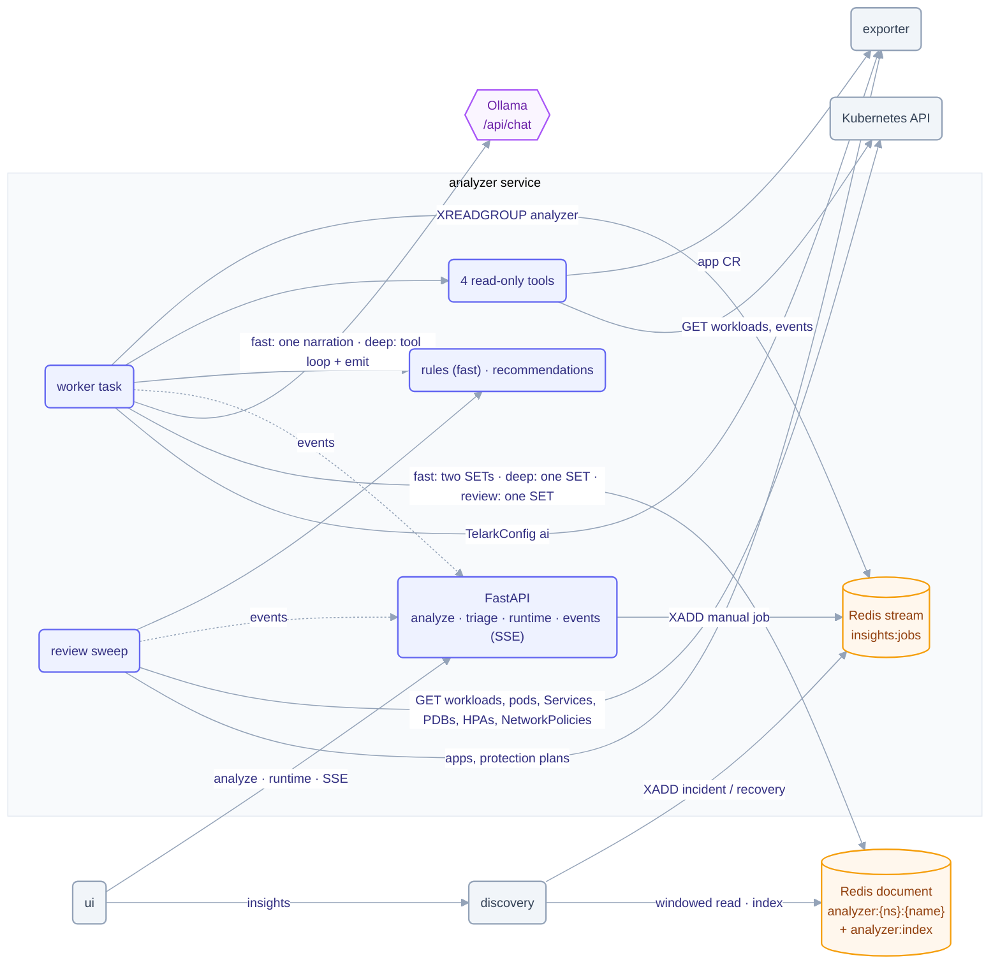

# analyzer service

The analyzer powers Telark's Insights page. It explains why an application is unhealthy and
reviews each application's setup, reading the cluster read-only and running a free, open-weight
model through Ollama in the cluster (no provider, no API key). This README is for contributors
and operators tuning it; the user-level overview is in [Concepts](../../docs/concepts.md#insights),
and [ARCHITECTURE.md](ARCHITECTURE.md) walks through the pipeline stage by stage.

One asyncio worker task consumes analysis jobs from a Redis stream, reads the app with four typed,
capped, read-only tools, and writes one document per app that the Insights page reads. In the
default **fast** mode (seconds on 2 vCPU) deterministic rules decide every insight and the model
only rewrites its title and summary; the opt-in **deep** mode (4+ vCPU or a GPU) lets the model
investigate with the tools. After every run, and on a slow in-process sweep, a **setup review**
evaluates 60 deterministic recommendation rules (never the model). Telark code (not the model) owns
ids, timestamps, validation, the insight lifecycle and persistence. When the analyzer is disabled,
absent or failing, core Telark is unaffected: discovery only appends to the stream (errors are
logged) and keeps serving the last document.

## Architecture



Jobs, the fast and deep runs, the tools, incident messages, the setup review and the Redis keys are
explained in [ARCHITECTURE.md](ARCHITECTURE.md).

## Runtime states

`GET …/runtime` reports one of `absent` (no Ollama at `OLLAMA_HOST`), `unreachable`, `model_missing`,
`pulling` (with progress), `unsupported` (deep mode only: the model has no tool calling) or `ready`, plus
`mode` (`fast` | `deep`), `autoPull` and `enabled` (TelarkConfig `ai.enabled`, for users who may read
insights but not the settings). The state is re-checked every `ANALYZER_CONFIG_POLL_SEC` and pushed as
`runtime.changed` (same fields). Fast mode needs only an installed model: `validate` answers
`model_lacks_tools` in deep mode only.

## Connected and air-gapped

- **Connected** (`OLLAMA_AUTO_PULL=true`, chart `app.ollama.autoPull=true`): while the analyzer is
  enabled, a missing model is pulled at the first config poll after start and by any run that needs
  it (the runtime needs 443 egress for pulls only). A failing pull is retried every poll; only the
  first failure in a row is logged. Only models of the license catalog (`LICENSES` in
  `constants.py`) are pulled, and a pull still running after an hour is canceled.
- **Air-gapped** (`OLLAMA_AUTO_PULL=false`, chart `app.ollama.autoPull=false`): no pulls, the pull
  route answers 409 `auto_pull_disabled`; the model is pre-loaded on the runtime volume. Fast runs
  still deliver rule insights without it.
- **Your own runtime** (chart `app.ollama.runtimeUrl`, which sets `OLLAMA_HOST`): any endpoint that
  speaks the Ollama API, no key. Set `ANALYZER_NUM_THREAD` to that host's cores.

## Failures

| Failure | Behavior (`lastRun.error`) |
|---|---|
| fast: model missing, pulling, runtime down, narration failed | run `done` with the rule cards (template prose, `steps` 0); a missing model is pulled when auto-pull is on |
| deep: Ollama down or absent | `runtime_unreachable`, job ACKed, worker backs off 15 s |
| deep: model missing / lacks tools | `model_not_installed` (pull starts when auto-pull is on) / `model_unsupported` |
| deep: model call timeout / Ollama busy twice | `model_timeout` / `busy`; nothing written |
| deep: context overflow | loop step: forced EMIT (low confidence); EMIT: `context_overflow` |
| deep: two bad tool-call steps / bad EMIT twice | `invalid_tool_calls` / `invalid_output` |
| Kubernetes tool timeout or error | the tool returns an error; the run is truncated (low confidence, no resolves). A 404 on a workload's status read is no truncation: the workload is gone and its card resolves |
| deep: loop or wall exhausted | forced truncated EMIT (low confidence, no resolves) |
| App deleted mid-run | `app_not_found`, document deleted |
| Stale, in-flight or dropped job | `job_expired` / `run_in_progress` / `job_dropped`, ACKed without a run; a sweep review holding the app is waited for up to 20 s first |
| Redis down | `storage_unavailable`; the API answers 503, ready fails |
| Anything unexpected | `internal_error` |

A `running` lastRun older than 540 s (crash mid-run) is shown as failed by the UI; the pending message is
reclaimed with `XAUTOCLAIM` on restart. Consumers that past pods leave in the group are removed once idle
for an hour with nothing pending.

## Layout

| Module | Role |
|---|---|
| `main.py` | Entry point: one uvicorn server on one event loop; the lifespan starts the worker task, the config poll and the review sweep |
| `api_server.py` | FastAPI app: status probes, analyze, triage, runtime, runtime validate/pull, SSE events |
| `authz.py` | Session scope check through auth-service (plus the denyable-action rule) |
| `config.py` | Environment parsing (the only module that reads env) |
| `constants.py` | Every literal, including the frozen contract mirrored from `internal/data` and `internal/rest` |
| `models.py` | Pydantic mirrors of the Go contract (same JSON names) and the analyzer's own models |
| `helpers.py` | Redis key builders (Go `DocumentKey` format), time helpers, quantities, label selectors, image references, probe signatures |
| `exporter.py` | The only exporter client: TelarkConfig `ai` + `excludedNamespaces`, application reads, the app list, protection plans, plan environments |
| `insights.py` | Insight document store (document + `analyzer:index`), the incident and recommendation lifecycles, triage |
| `analyzer.py` | fast: gather + rules, narration; deep: tool loop, EMIT, fit check, wall/EMIT reserve, failure mapping |
| `rules.py` | Fast mode's detector: candidate insights from the tool results (pure) |
| `messages.py` | Incident sub-reasons and params, server title/summary templates, recommendation texts (pure) |
| `review.py` | The setup review's read-only gather with a completeness flag per input family, usage samples |
| `recommendations.py` | The 60 recommendation rules (pure) |
| `runtime.py` | Model runtime state (absent, unreachable, model_missing, pulling, unsupported, ready), mode, pull |
| `events.py` | In-process broadcaster: one bounded queue per SSE connection, `resync` on overflow |
| `tools/` | The four read-only tools, their argument schemas, caps and binding |
| `providers/ollama.py` | Ollama HTTP client (tags, show, chat, streaming pull) |
| `prompts/analyzer_prompt.py` | Deep: system prompt, user message, EMIT schema; fast: narration prompt and schema |
| `app_logger.py` | Log formatting |
| `tests/` | pytest suites (`test_*_cov.py` plus the named suites) and the shared `fakes.py` |

## Dependencies

- **Runtime:** Python 3.13+ (image ships 3.14): FastAPI, uvicorn, pydantic, redis (`redis.asyncio`),
  httpx, loguru, python-dotenv. Ollama and the Kubernetes API are reached with httpx; no model SDK,
  Kubernetes client or agent framework.
- **Pins:** edit `requirements.in` (runtime) or `requirements-test.in` (test tools), never the `.txt`
  hash locks the image and CI install with `--require-hashes`. Regenerate both locks with the command in
  their headers, runtime first (`uvx --python 3.13 --with 'click<8.3' --from pip-tools pip-compile ...`:
  click 8.3+ writes a bogus `--no-index` into the header).
- **Infrastructure:** Redis (job stream, insight documents, the `analyzer:index` ZSET, the `analyzer:usage`
  and `analyzer:review` hashes, in-flight and cooldown keys), Ollama.
- **Peers:** reads TelarkConfig, applications, protection plans and plan environments from **exporter**
  (HTTP + service token); checks sessions with **auth-service**; reads workloads, pods, events, Services,
  PodDisruptionBudgets, HorizontalPodAutoscalers and NetworkPolicies from the **Kubernetes API** (GET only,
  the pod's service account); **discovery** appends jobs and serves the documents and the Insights page.

## Configuration

Whether the analyzer runs, the model, `autoAnalyze` and the excluded namespaces live in `TelarkConfig`
(Settings), polled every `ANALYZER_CONFIG_POLL_SEC`. A fresh install seeds `ai.enabled: true`,
`model: granite4:350m`, `autoAnalyze: false`; an existing TelarkConfig is never rewritten. Env holds endpoints
and caps. Full reference:
[chart README](../../charts/telark/README.md#servicesanalyzerenv).

| Variable | Default | Description |
|---|---|---|
| `REDIS_HOST` / `REDIS_PORT` | `localhost` / `6379` | Redis address |
| `REDIS_URL` | unset | Overrides host and port when set |
| `REDIS_PASSWORD` | unset | Redis password (chart: from the Redis Secret); unset sends none |
| `REDIS_POOL_SIZE` | `10` | Redis connection pool size |
| `OLLAMA_HOST` | `http://localhost:11434` | Model runtime endpoint (chart: the subchart, or `app.ollama.runtimeUrl`) |
| `OLLAMA_AUTO_PULL` | `true` | Pull a missing model after start and when a job needs it (`false` for air-gapped installs) |
| `LOG_LEVEL` | `INFO` | Log level |
| `API_PORT` | `8080` | HTTP port |
| `AUTH_SERVICE_URL` | `http://telark-auth-service:8080` | auth-service base URL |
| `EXPORTER_SERVICE_URL` | `http://telark-exporter-service:8080` | exporter base URL |
| `TELARK_SERVICE_TOKEN` | unset | Service token sent to exporter |
| `CORS_ALLOWED_ORIGINS` | unset | Comma-separated origins that get CORS headers (local dev only, e.g. `http://localhost:3000`; behind nginx the UI is same-origin); empty adds none |
| `ANALYZER_MODE` | `fast` | `fast` (rules + one narration) or `deep` (tool loop); anything else fails startup |
| `ANALYZER_NUM_THREAD` | `2` | `options.num_thread` of every model call: the runtime's CPU limit, never above the node's vCPU |
| `ANALYZER_NARRATE_TIMEOUT_SEC` | `45` | HTTP timeout of the fast narration |
| `ANALYZER_MAX_STEPS` | `8` | Tool-loop steps per run (deep) |
| `ANALYZER_MAX_TOOL_CALLS` | `8` | Tool calls per run (deep) |
| `ANALYZER_TOOL_RESULT_MAX_BYTES` | `2048` | Size cap of one tool result |
| `ANALYZER_WALL_SEC` | `480` | Wall-clock budget of one run (deep) |
| `ANALYZER_LOOP_TIMEOUT_SEC` | `120` | HTTP timeout of one loop call (deep) |
| `ANALYZER_EMIT_TIMEOUT_SEC` | `180` | HTTP timeout of the EMIT call (deep) |
| `ANALYZER_CHARS_PER_TOKEN` | `3.5` | Byte-to-token estimate for the fit check (deep) |
| `ANALYZER_CONTEXT_TOKENS` | `4096` | Model context window (`num_ctx`); deep mode wants `8192` |
| `ANALYZER_QUEUE_MAX` | `100` | Stream backlog above which manual analyze answers 429 |
| `ANALYZER_AUTO_COOLDOWN_SEC` | `600` | Per-app cooldown of incident jobs |
| `ANALYZER_MANUAL_COOLDOWN_SEC` | `60` | Per-app cooldown of manual analyze |
| `ANALYZER_CONFIG_POLL_SEC` | `30` | TelarkConfig and runtime re-check interval |
| `ANALYZER_REVIEW_INTERVAL_SEC` | `7200` | Re-review an unchanged app after this long; `0` turns the sweep off |
| `ANALYZER_REVIEW_TICK_SEC` | `120` | Sweep tick |
| `ANALYZER_REVIEW_APPS_PER_MIN` | `20` | Sweep pace (apps reviewed per minute) |
| `ANALYZER_REVIEW_WORKLOADS_MAX` | `10` | Workloads read per review (those with an incident first) |
| `ANALYZER_USAGE_MIN_SAMPLES` | `12` | Usage samples a usage rule needs |
| `ANALYZER_USAGE_MIN_SPAN_SEC` | `43200` | Time those samples must span |
| `ANALYZER_CHANGE_VELOCITY_PER_DAY` | `20` | Changes per day (7-day average) that flag `change_risk.high_velocity` |
| `ANALYZER_CHANGE_RISK_MIN_SPAN_SEC` | `259200` | History an app needs before change-risk rules apply |
| `ANALYZER_PRODUCTION_PATTERN` | `(^\|[-_.])(prod\|production\|prd)($\|[-_.])` | Case-insensitive; an invalid regex fails startup |

## API

Every route but the probes needs `X-Session-Token`; responses use the Go envelope
`{status, operation, message, data}`. A missing token, or one auth-service rejects (invalid or expired), is
401; a suspended or deleted user, or a missing grant, is 403; auth-service unreachable is 503.
A request body over 64 KiB is 413 before it is read (FastAPI reads the body before the session check).
There are no `/docs`, `/redoc` or `/openapi.json` routes.

The SSE stream re-checks its session every minute and ends once auth-service answers 401 or 403 (an auth
outage keeps it open); a user holds at most 8 streams, the next is 429 `too_many_streams`.

| Method | Path | Access |
|---|---|---|
| `GET` | `/api/v1/status/live`, `/api/v1/status/ready` | public (ready = Redis `PING`; the model runtime never affects it) |
| `POST` | `/api/v1/insights/applications/{namespace}/{name}/analyze` | `insights` Contributor, denied by the `insights.analyzeinsights.deny` rule (deep mode: 503 `runtime_<state>` unless the runtime is `ready`) |
| `POST` | `/api/v1/insights/applications/{namespace}/{name}/insights/{id}/triage` `{action}` | `insights` Contributor, denied by the `insights.triageinsights.deny` rule; 200 `{data: Insight}`, 400 `invalid_request`, 404 `app_not_found` / `insight_not_found`, 409 `invalid_triage` |
| `GET` | `/api/v1/insights/events?apps=ns/name,…` (SSE) | `insights` ReadOnly or `settings` Owner |
| `GET` | `/api/v1/insights/runtime` | `insights` ReadOnly or `settings` Owner |
| `POST` | `/api/v1/insights/runtime/validate` | `settings` Owner, denied by the `settings.controlainsights.deny` rule |
| `POST` | `/api/v1/insights/runtime/pull` | `settings` Owner, denied by the `settings.controlainsights.deny` rule; 400 `model_not_allowed` for a model outside the license catalog (`LICENSES` in `constants.py`) |

Triage `action` is `acknowledge`, `dismiss` or `reopen`. `dismiss` is for recommendations only and
holds while the card's facts are unchanged; a change, a resolve or `reopen` clears it. Acknowledging a
resolved card or dismissing an incident is the 409. A triage that changes nothing is not written, and
triage works whether the analyzer is enabled or not.

## Build & run

```sh
python -m venv ~/.venvs/analyzer && . ~/.venvs/analyzer/bin/activate   # outside the tree: compileall and --cov=. scan it
pip install --require-hashes -r requirements-test.txt
python main.py                       # API + worker on one event loop; needs Redis (fast mode runs without a model)
python -m pytest --cov=. --cov-report= tests/test_*_cov.py -q
python -m pytest --cov=. --cov-append --cov-report= tests/test_authz.py tests/test_insights.py tests/test_exporter.py -q
python -m coverage report --fail-under=95
docker build -t ghcr.io/telark/analyzer:<version> .
```

Outside a pod the two Kubernetes tools answer `k8s_unavailable`. The tests need neither Redis nor Ollama:
they run against the fakes in `tests/fakes.py`.

Runs in-cluster via the [telark chart](../../charts/telark); see [INSTALL](../../docs/INSTALL.md)
and [CONTRIBUTING](../../CONTRIBUTING.md).
