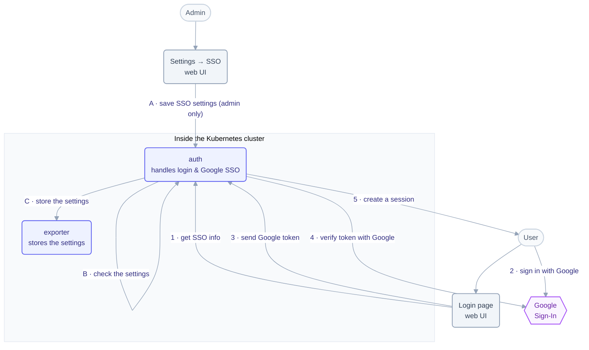

# Login & Single Sign-On — How it works

How signing in with Google works in Telark. There are two separate flows: an
**admin turns SSO on** (letters A–C), and then a **user signs in** (numbers 1–5).

## Turning SSO on (admin)

- **A** — An admin fills in the SSO settings (Google client ID, etc.) on the
  Settings → SSO page. Only an admin can do this.
- **B** — **auth-service** checks the settings are usable before saving them
  (a broken config that can't sign anyone in must never be stored).
- **C** — auth-service saves the settings through **exporter-service**.

## Signing in (user)

1. The login page asks auth-service what sign-in options are on (it learns the
   Google client ID). The Google button only shows if SSO is configured.
2. The user signs in with Google and gets a Google token.
3. The login page sends that token to auth-service.
4. auth-service checks the token really came from Google.
5. If it's valid, auth-service finds the user by the token's subject. On a first
   login it attaches the Google identity to the one user whose email matches, or
   creates a user when none does; two users with that email are refused (409).
   A user being deleted or whose account is not active gets no session (403).
   Otherwise auth-service creates a Telark session and the user is logged in.

## How auth-service trusts Google (the important part)

To check a Google token in step 4, auth-service needs Google's public keys. There
are two modes, controlled by one setting:

- **Cluster can reach the internet** (`egressAllowed = true`): auth-service fetches
  Google's keys directly and refreshes them automatically.
- **Air-gapped cluster** (`egressAllowed = false`): no internet. An admin pastes
  Google's public keys into the settings, and auth-service trusts **only** those.

## Notes for developers

- SSO settings live in the `TelarkConfig` CR named `default`, under `oidc`
  (`enabled`, `googleClientID`, `egressAllowed`). The pasted key set
  (`googleJwkJson`) is the trust anchor, so it lives apart in the Secret
  `telark-oidc-trust-secret` (key `googleJwkJson`, or the Secret named by
  `app.auth.oidc.existingSecret`), guarded by its own admission policy.
  auth-service reads it as a mounted file (`OIDC_TRUST_FILE`) and re-reads the
  settings per login, so changes take effect without a restart; other auth
  replicas see a new key set after the kubelet sync (about a minute).
  `GET /api/v1/config` on the exporter returns the key set merged back under
  `oidc.googleJwkJson`.
- Endpoints: `GET /auth/config` is **public** (returns only the client ID, which is
  not a secret); `PATCH /auth/oidc/config` saves settings and is guarded by
  `editoidcconfig = settings:Admin`; `POST /auth/oidc/google/callback` handles the
  token from step 3.
- auth-service validates the settings and writes them with `PATCH /api/v1/config`
  on exporter-service using a service token (the exporter puts the key set in
  the Secret and the rest in the CR); the route's Admin check is what enforces authorization.
