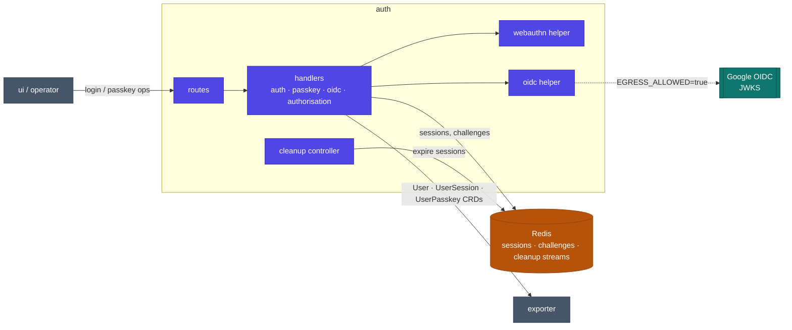

# auth service

Operator authentication and the role model. Auth handles passwordless login with
**WebAuthn passkeys** (FIDO2) and **Google OIDC**, issues and reconciles sessions, and
reconciles the role/authorization resources. It holds no database of its own: sessions
and challenges live in Redis, and users/passkeys/sessions are persisted as CRs through
exporter.

## Architecture



## Responsibilities

- **Passkey auth:** WebAuthn registration and assertion (login start/finish), passkey CRUD.
- **Google OIDC:** token verification against Google's JWKS — fetched live (`EGRESS_ALLOWED=true`) or from a pasted key set for air-gapped clusters.
- **Sessions:** issue, validate (`X-Session-Token`), and expire; a cleanup controller sweeps expired sessions and challenges.
- **Role model:** reconcile authorization resources; grant the Admin role to `BOOTSTRAP_ADMINS` on first login.
- **Provisioning policy:** `SELF_REGISTRATION_ENABLED` gates the passkey path only — OIDC users are always auto-provisioned.
- **Ops subcommands:** `backfill` (migrate/seed auth data) and `breakglass` (emergency admin access) via the binary's `cmd` dispatch.

## Layout

| Package | Role |
|---|---|
| `internal/routes` | HTTP route registration |
| `internal/handlers/{auth,passkey,oidc,authorisation,config,cleanup,status}` | Request handlers per domain |
| `internal/helpers/{webauthn,oidc,auth,redis,shared}` | WebAuthn/OIDC logic, Redis access, shared helpers |
| `internal/controllers/cleanup` · `internal/coordination/cleanup` | Session/challenge expiry reconciler + its coordination |
| `internal/clients` | Exporter REST client wrappers |
| `internal/cmd/{backfill,breakglass}` | CLI subcommands |
| `internal/authz` | Per-route authorization requirements |

## Dependencies

- **Internal modules:** `data` (auth types, errors), `rest` (exporter client, router, server), `x-ware` (Redis, authz, CORS). **No `kcore`** — auth never touches the K8s API directly; all CRD access is through exporter.
- **Infrastructure:** Redis (sessions, challenges, cleanup streams).
- **Peers:** persists CRs through **exporter**; verifies tokens against **Google OIDC** (external, optional egress).

## Configuration

Full reference: [chart README](../../charts/telark/README.md#servicesauthenv). Key vars:

| Variable | Default | Description |
|---|---|---|
| `RP_ID` / `RP_NAME` / `RP_ORIGIN` | `localhost` / `Dashboard App` / `http://localhost:3000` | WebAuthn relying-party identity |
| `SELF_REGISTRATION_ENABLED` | `true` | `false` blocks new passkey registration |
| `CHALLENGE_TIMEOUT` / `SESSION_EXPIRY` | `60` (s) / `24` (h) | Challenge / session TTLs |
| `BOOTSTRAP_ADMINS` | — | Comma-joined admin emails granted Admin on first login |
| `GOOGLE_CLIENT_ID` | — | Google OAuth client id |
| `EGRESS_ALLOWED` | `true` | `false` = offline JWKS from `GOOGLE_OIDC_JWK_JSON` |
| `REDIS_DB` | `1` | Redis DB index |

## API

REST under `/api/v1/auth/` — login `start`/`finish`, `logout`, passkey CRUD, OIDC login,
and permissions; status probes at `/api/v1/status/{live,ready}`. All passkey and
session-scoped calls require the `X-Session-Token` header.

## Build & run

```sh
go build ./...
docker build -t telark/auth:<version> .
```

Runs in-cluster via the [telark chart](../../charts/telark); see [INSTALL](../../docs/INSTALL.md)
and [CONTRIBUTING](../../CONTRIBUTING.md).
