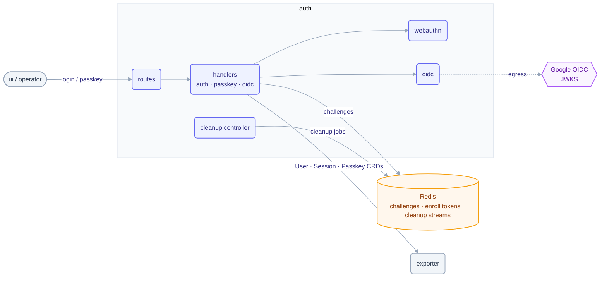

# auth service

The auth service signs people in to Telark. It handles passwordless login with WebAuthn
passkeys and Google OIDC, creates sessions, runs the break-glass admin enrollment, and cleans
up references when a user, group or role is deleted. It keeps no database: users, passkeys
and sessions are CRs written through exporter, and login challenges live in Redis.

## Architecture



## Responsibilities

- **Passkey auth:** WebAuthn registration and assertion (login start/finish), passkey CRUD.
- **Google OIDC:** token verification against Google's JWKS, fetched live (`egressAllowed` in the TelarkConfig `oidc` block) or from a pasted key set for air-gapped clusters (`OIDC_TRUST_FILE`). The token's subject picks the user; a first login with no stored subject attaches the identity by email only when exactly one user carries that email and that account has no identity yet (409 otherwise). A login that resolves to the bootstrap admin, by subject or by email, is refused (403, `the bootstrap administrator signs in with a passkey`). Full admin-config + login flow: **[OIDC.md](OIDC.md)**.
- **Sessions:** issue and validate (`X-Session-Token`); sessions are `Session` CRs written through exporter. An expired session is refused on use, and a user's expired sessions are deleted when that user gets a new session; there is no global sweeper. A session the exporter reports as expired (410) answers 401, never 503; only an unreachable exporter is an outage. No login path mints a session for a user being deleted or whose account is not active (403); a suspended account is told `user account is suspended`, and only once its passkey or Google token has been verified. A login's last-login stamp never writes the account phase.
- **Cleanup cascade:** deleting a user, group or role through the cleanup API clears every back-reference before the finalizer is dropped; a user's sessions and passkeys are deleted first, so revoked access does not outlive the deletion. The route requires Owner on the scope and honors the `deleteuser` / `deletegroup` / `deleterole` deny rules; an id the exporter no longer has answers 404. A failed pass is retried with exponential backoff (`RECONCILE_BACKOFF_INITIAL_SECONDS` doubling up to `RECONCILE_BACKOFF_MAX_SECONDS`, capped by `CLEANUP_XCLAIM_MIN_IDLE_SECONDS`), a job whose worker died is reclaimed once it has idled past that threshold, and the dead-letter stream is capped at 1000 entries.
- **User deletion rules:** a user never deletes their own account; bootstrap users (`bootstrap: true` on the user record) are never deleted through the API (403); a caller below Admin targeting either a bootstrap user or an administrator (Admin on ALL, direct or via a group, suspended or not) is answered 404; any other Admin may delete an administrator. Internal callers are not gated here; the exporter refuses (409) a delete that would leave no active Admin.
- **Role and group deletion rules:** deleting a role, or a group, takes its levels from every holder, so each level of the role (or of every role the group assigns) must be within the caller's own on that scope or on ALL; otherwise 403 (`role <name> cannot be changed, removed or deleted: it grants <level> on <scope>, above your own level on that scope`). An Admin on ALL may delete any role or group. A role or group already gone passes to the exporter (404); internal callers are not gated here.
- **Role model:** reconcile authorization resources. OIDC and passkey self-registration always create a ReadOnly account without the `bootstrap` marker, even for the `BOOTSTRAP_ADMIN` email; bare-email passkey registration refuses that email. Only `break-glass` grants the bootstrap admin its Admin role and marker, and it drops any non-passkey identity from that account, so no OIDC binding survives: the bootstrap admin signs in with a passkey only.
- **Provisioning policy:** self-registration (the TelarkConfig `selfRegistration.enabled`, off by default, read through a cache that asks the exporter at most once every 5 seconds and keeps the last value when a read fails) gates the passkey path only; OIDC users are always auto-provisioned. A bare email opens a registration only for an account that does not exist yet, and that account is created only when the ceremony finishes with a verified passkey (an abandoned start leaves nothing behind); an existing account adds a passkey through its session or a one-time enrollment link.
- **Enrollment links for another user:** `POST auth/users/{id}/enroll-link` (201, `{token, expiresAt}`, the token shown once) and `DELETE` (revoke). Owner on users, capped like a role assignment: every level the target holds, directly or through a group, must be within the caller's own (403). Oneself (403), a hidden administrator or bootstrap account (404 below Admin on ALL, 403 for the bootstrap account otherwise), a terminating (410) or suspended (409) account are refused; revoking skips the last two. An account that already has a passkey needs the bootstrap account or Admin on ALL, and its owner is notified when the link is created and when it is used. Redis keeps only the token's SHA-256 digest (`auth:passkey:invite:<digest>` and `auth:passkey:invite-of:<user>`, both with `ENROLL_INVITE_TTL_SEC`), one live link per user; the user's `status.invite` records issuer and expiry for display and is cleared on revoke and once a passkey is stored; that passkey also stamps `status.inviteAcceptedAt` (Members shows "Enrolled").
- **Sign-in settings:** `PATCH auth/oidc/config` and `PATCH auth/self-registration` are refused (403) to everyone but the bootstrap account, read from the caller's own user record (503 when it cannot be read).
- **Ops subcommands:** `backfill-finalizers` (migrate/seed auth data) and `break-glass --email <email> [--enroll]` (the bootstrap admin's access: any email but `BOOTSTRAP_ADMIN` is refused before anything is read or written; `--enroll` creates that account when missing and prints a one-time enrollment token, the operator-run way to enroll the first administrator on a passkey-only install) via the binary's `cmd` dispatch.

## Layout

| Package | Role |
|---|---|
| `internal/routes` | HTTP route registration |
| `internal/handlers/{auth,passkey,oidc,authorization,config,cleanup,status}` | Request handlers per domain |
| `internal/helpers/{webauthn,oidc,auth,redis,shared}` | WebAuthn/OIDC logic, Redis access, shared helpers |
| `internal/controllers/cleanup` · `internal/coordination/cleanup` | Deletion cleanup reconciler (sessions, passkeys and back-references of deleted users, groups and roles) + its coordination |
| `internal/clients` | Exporter REST client wrappers |
| `cmd` | CLI subcommands ([cmd/README.md](cmd/README.md)) |
| `internal/authz` | Per-route authorization requirements |

## Dependencies

- **Internal modules:** `data` (auth types, errors), `rest` (exporter client, router, server), `x-ware` (Redis, authz, CORS). **No `kcore`**: auth never touches the K8s API directly; all CRD access is through exporter.
- **Infrastructure:** Redis (WebAuthn challenges, OIDC nonces, enrollment tokens, cleanup streams).
- **Peers:** persists CRs through **exporter**; verifies tokens against **Google OIDC** (external, optional egress).

## Configuration

Full reference: [chart README](../../charts/telark/README.md#servicesauthenv). Key vars:

| Variable | Default | Description |
|---|---|---|
| `RP_NAME` | — (required) | WebAuthn relying-party display name |
| `RP_ID` / `RP_ORIGIN` | — | WebAuthn relying-party id / allowed origins; when empty, both are resolved from the request host |
| `ENROLL_INVITE_TTL_SEC` | `3600` | Lifetime of an enrollment link created for another user; a zero, negative or malformed value keeps the default |
| `CHALLENGE_TIMEOUT` / `SESSION_EXPIRY` | `60` (s) / `24` (h) | Challenge / session TTLs |
| `BOOTSTRAP_ADMIN` | — (required) | The bootstrap admin's email, enrolled and recovered with `break-glass --enroll`; auth refuses to start without it |
| `OIDC_TRUST_FILE` | `/etc/telark/oidc/googleJwkJson` | Pasted Google JWK set, mounted from the Secret `telark-oidc-trust-secret`; re-read when it changes |
| `REDIS_DB` | `0` (chart: `1`) | Redis DB index |

The Google client id, the egress mode and self-registration are not env vars: they live in the TelarkConfig (`oidc`, `selfRegistration`), set through `PATCH auth/oidc/config` ([OIDC.md](OIDC.md)) and `PATCH auth/self-registration` (`{"enabled": true}`). The cleanup tunables (`RECONCILE_*`, `CLEANUP_*`, `BACKFILL_*`) take positive integers; a malformed, zero or negative value falls back to its default with a warning.

## API

REST under `/api/v1/auth/`: login `start`/`finish`, `logout`, passkeys (`GET`/`POST auth/passkeys`,
`GET`/`PATCH`/`DELETE auth/passkeys/{credentialId}`, `auth/passkeys/enroll-link`), enrollment links
for another user (`POST`/`DELETE auth/users/{id}/enroll-link`), OIDC login and config, the
self-registration toggle (`PATCH auth/self-registration`), permissions, and the deletion cascade
(`DELETE auth/{users,groups,accessroles}/{id}`); status
probes at `/api/v1/status/{live,ready}`. Passkey and session-scoped calls require the
`X-Session-Token` header, except `POST auth/passkeys`, which also finishes a registration opened
by `register/start` (with an enrollment token or a bare email) and requires `X-Device-Name` and
`X-Device-Type`. `PATCH`/`DELETE auth/passkeys/{credentialId}` relay the exporter's refusal: 404
for an unknown credential or another account's (indistinguishable), 400 for the last passkey. A request body over 1 MiB answers 413. auth
stores passkeys and sessions (`Passkey`, `Session` CRs) through the exporter's `internal/auth/*` routes.

## Build & run

```sh
# from the repo root: the image builds the service together with internal/
go build ./services/auth
docker build -f services/auth/Dockerfile -t ghcr.io/telark/auth:<version> .
```

Runs in-cluster via the [telark chart](../../charts/telark); see [INSTALL](../../docs/INSTALL.md)
and [CONTRIBUTING](../../CONTRIBUTING.md).
