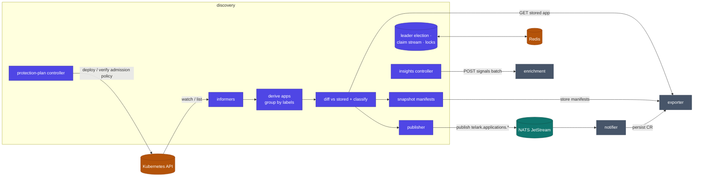
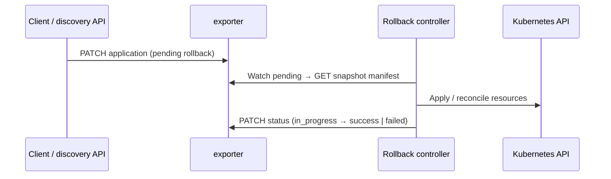

# discovery service

The engine that turns raw workloads into protected applications. Discovery watches the
cluster, groups workloads into **applications**, diffs each against its last stored spec,
classifies the change, snapshots the manifests, and publishes the result. It also runs
the **protection-plan** lifecycle and the **rollback** path. Every replica cooperates
over Redis so the work stays correct and non-duplicated at scale.

Discovery never writes the `ApplicationAsResource` CR directly — it publishes to NATS and
lets [notifier](../notifier) persist through [exporter](../exporter). Exporter remains the
single CR writer.

## Architecture



## Responsibilities

- **Discover:** watch workloads via `kcore` informers and group them into applications by label derivation.
- **Diff & classify:** compare the live app to the last stored spec (from exporter) and resolve overlapping signals into a single change class.
- **Snapshot:** on each material change, read and sanitize the workload manifests and store them through exporter — the audit trail and rollback targets.
- **Publish:** emit `telark.applications.{update,delete}` to NATS; notifier persists the CR via exporter.
- **Enrich:** the leader tick dispatches application signals to enrichment (`POST /api/v1/insights/applications`) when AI is configured — fire-and-forget, never blocking on the model.
- **Protect:** drive the protection-plan lifecycle (`scheduled → active → terminated`); while active, deploy admission policies for the plan's scope and verify their health against live cluster state.
- **Rollback:** apply a chosen snapshot back to the cluster under explicit intent, with controller-driven status.

## How change detection works

Discovery compares the stored application to a freshly derived one: images, replica
counts, health transitions, CPU/memory requests and limits, ports, env-var keys, chart
version, resource membership, and counts. Overlapping signals collapse into one
`changeClass` by priority (many simultaneous categories become **drift**).

| Class | Trigger |
|---|---|
| `topology` | Resource membership changed (objects added/removed) |
| `deployment` | Container image reference changed |
| `scaling` | Replica count changed |
| `resources` | CPU/memory requests or limits changed |
| `config` | Env-var keys or ports changed |
| `incident` | Health degraded or down |
| `recovery` | Health restored after an incident |
| `rollback` | A snapshot was applied to the cluster |
| `drift` | Multiple categories in one detection window |

## Distributed coordination

Redis coordinates the replicas — it never carries application payloads (that is REST +
NATS). One leader enqueues work; workers consume a stream under a consumer group, each
holding a per-app lock.

```mermaid
sequenceDiagram
  participant L as Leader replica
  participant R as Redis
  participant W as Worker replica
  participant NJ as NATS JetStream
  participant NTF as notifier
  participant EXP as exporter

  L->>R: Campaign leader lease (SET NX + TTL)
  L->>R: XADD operations stream (batch)
  W->>R: XREADGROUP (consumer group)
  W->>R: Acquire per-app lock
  W->>W: Derive / diff / snapshot
  W->>NJ: Publish telark.applications.update
  NJ->>NTF: Deliver
  NTF->>EXP: PATCH / CREATE application
  W->>R: Ack, release lock
  Note over L,R: Leader renews its lease; followers skip enqueue
  Note over W,R: On shutdown: reclaim stale claims, delete consumer
```

| Key pattern | Purpose | TTL source |
|---|---|---|
| leader lease | Single writer for batch enqueue | `COORDINATION_ELECTION_TTL_SEC` (15s), renewed every `…_RENEW_SEC` (5s) |
| operations stream + consumer group | Hand work to workers | Redis retention |
| per-app lock | Serialize processing per app | `COORDINATION_LOCK_TTL_SEC` (120s), heartbeat `…_HEARTBEAT_SEC` (30s) |
| dedup key | Skip duplicate enqueue in a cycle | `COORDINATION_DEDUP_TTL_SEC` (60s) |
| replica heartbeat | Detect dead stream consumers | swept every `COORDINATION_STALE_CLAIM_INTERVAL_SEC` (60s) |

## Rollback

Rollback is intent-based: a client appends a pending `rollbacks[]` entry to the Application
CR (via exporter); the in-cluster controller applies the target snapshot and advances status.



## Layout

| Package | Role |
|---|---|
| `internal/informers` | `kcore` dynamic informers over cluster workloads |
| `internal/discovery/{derivation,groupbylabels,listing,prewarm,cache}` | Derive applications from live state |
| `internal/core/{applications,plans}` | Core application + protection-plan domain logic |
| `internal/controllers/{insights,plans}` | Leader-tick enrichment dispatch; protection-plan reconcile |
| `internal/coordination/{forcesync,leadergate}` | Leader election, claim queue, force-sync |
| `internal/publisher` · `internal/helpers/nats` | NATS JetStream publishing |
| `internal/handlers/{analyze,resources,plans,rollback,insights,namespaces,cleanup,status}` | HTTP handlers |
| `internal/clients` | Exporter + enrichment REST client wrappers |
| `internal/informers` · `internal/state` · `internal/startup` · `internal/circuitbreaker` | Watch state, boot wiring, resiliency |

## Dependencies

- **Internal modules:** `data`, `kcore` (informers/client), `rest` (clients, router, server), `x-ware` (Redis, NATS, authz, CORS).
- **Infrastructure:** Kubernetes API (watch + admission policy), Redis (coordination), NATS JetStream (publish).
- **Peers:** reads/stores via **exporter**; publishes to **notifier** (NATS); dispatches to **enrichment** (HTTP).

## Configuration

Discovery is the most tunable service. The full, authoritative env reference lives in the
[chart README](../../charts/telark/README.md#servicesdiscoveryenv) — K8s client rate limits,
informer resync/coalescing, coordination TTLs, snapshot writer, protection-plan tick,
force-sync, and auto-cleanup. Per-cluster overrides come from the
[install-mode overlays](../../docs/INSTALL.md#sizing-modes-optional), not this service's defaults.

## API

REST under `/api/v1/` — `analyze/*` (namespace workloads/resources), `resources/*`
(applications), `plans/*` (protection plans), `rollback` intents, and
`/api/v1/status/{live,ready}`.

## Build & run

```sh
go build ./...
docker build -t telark/discovery:<version> .
```

Runs in-cluster via the [telark chart](../../charts/telark); see [INSTALL](../../docs/INSTALL.md)
and [CONTRIBUTING](../../CONTRIBUTING.md).
