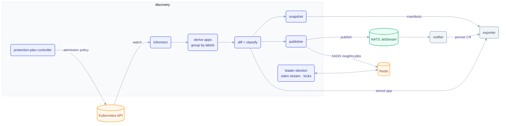
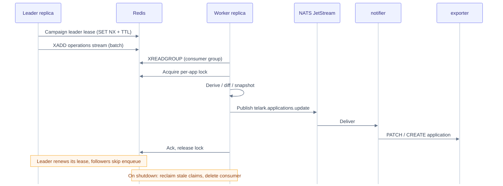

# discovery service

The engine that turns raw workloads into protected applications. Discovery watches the
cluster, groups workloads into **applications**, diffs each against its last stored spec,
classifies the change, snapshots the manifests, and publishes the result. It also runs
the **protection-plan** lifecycle and the **rollback** path. Every replica cooperates
over Redis so the work stays correct and non-duplicated at scale.

Discovery never writes the `ApplicationAsResource` CR directly — it publishes to NATS and
lets [notifier](../notifier) persist through [exporter](../exporter). Exporter remains the
single CR writer.

## Architecture



## Responsibilities

- **Discover:** watch workloads via `kcore` informers and group them into applications by label derivation. The grouping label value names the Application CR, so it is lowercased with `_` as `-`; a value that still is not a DNS-1123 subdomain is skipped and logged once. CronJob and Job pod specs feed images, ports, env keys and config/secret refs like the other workload kinds.
- **Diff & classify:** compare the live app to the last stored spec (from exporter) and resolve overlapping signals into a single change class. An entry's `detectedAt`/`changedBy` come from the `telark.io/last-modified-*` annotations only when the informer flush saw the annotation change with the write; a `/scale` write (annotation unchanged), a health-only change (a readiness move is nobody's write) and a tick-recorded change carry the detection time and no author. Manifest-level change text names the object as `namespace/Kind/name`, so a multi-namespace app's changes are told apart.
- **Snapshot:** on each material change, read and sanitize the workload manifests and store them through exporter — the audit trail and rollback targets. The pre-image comes from the informer's old object; a health-only change (readiness moved, manifests unchanged) snapshots the live manifests, so a recovery is never left unrecorded. Any other change the tick sees without a pre-image (a resource that joined while discovery was down) waits two ticks for the informer flush and is then recorded against the live state, so the CR never stays stale. Snapshot entries carry the class and severity of the change they precede.
- **Publish:** emit `telark.applications.{update,delete}` to NATS; notifier persists the CR via exporter on update and calls this service's application reset on delete (the reset deletes the CR through exporter, and clears the app's Redis state; a re-discovered app also starts from a clean state). `POST .../{name}/reset` and `POST .../{name}/sync` answer 404 for an application the store does not hold. A non-leader replica forwards a reset to the leader only after the Kubernetes API confirms the address advertised in Redis is the leader pod's IP and that pod carries its own component label; the forward carries this replica's service token and the verified `X-User-ID`, never the caller's headers, and only the status, `Content-Type` and body come back. The `analyze/*` namespace lists refuse excluded namespaces and the release namespace (403), and refuse every namespace while the excluded list has never loaded (503).
- **Trigger:** on an authored incident/recovery change-log entry, XADD a job to `insights:jobs` (best effort, off the publish path once the exporter serves that generation, at most 5 s later); the windowed insights read (`GET insights/applications?apps=`, at most 100 keys, 400 above) filters by excludedNamespaces: it skips apps whose document namespace is excluded and drops cards whose workload namespace (`params.namespace`, else the document's) is excluded, keeping the stored `version`.
- **Insights list:** keep a per-replica row index of every app's insight cards for the cluster-wide list (`GET insights/get`), fed from the `analyzer:index` ZSET; no Redis on the request path.
- **Protect:** drive the protection-plan lifecycle (`pending_approval → scheduled → active → terminated`); while active, deploy admission policies for the plan's scope (one policy per template and namespace, so an application spanning several namespaces is covered in each) and verify their health against live cluster state. Plans that require approval are parked in `pending_approval` until an approver decides; nothing is deployed while pending. Validation rejects a window that has already ended, targets in the release namespace or in GlobalConfig `excludedNamespaces` (the policy engine skips them), and a template listed twice; repeated targets are deduplicated. Plan names are unique (case- and whitespace-insensitive): a name already taken is a 409 on create, duplicate and rename, and a per-name lock (`lock:plan-name:<name>`) makes parallel creates or renames of one name yield one winner and a 409 for the rest. Unknown template params are rejected. Every phase is editable: an edit that moves the window recomputes the phase (a scheduled plan made permanent or whose start has passed deploys at once; an active plan given a future start withdraws its policies and waits for the controller), a rename re-renders the live policies, and an edit of a canceled or terminated plan is stored and takes effect on reactivation. Rules exempt the engine's own `Policy`, `PolicyReport` and `EphemeralReport` writes; audit-mode messages read "would be blocked". Every rendered policy carries a `telark.erpi/render-hash` annotation; the health pass compares it with a fresh render and redeploys a policy whose content differs (or that predates the annotation), so an upgrade of the renderer re-renders active plans on the next tick without a cancel and reactivate. An application that vanished from an app-scope plan is skipped, as violations and reports do, rather than failing the repair every tick.
- **Rollback:** replace the app's objects with a chosen snapshot under explicit intent, with controller-driven status; `triggeredBy` is the authenticated caller.
- **Report:** render protection plan reports (HTML, Markdown, JSON, CSV) and store them through exporter. A final report is captured asynchronously right after a plan ends — after the terminal patch removes its policies and records its phase — bounded at 10 s and serialized. A checkpoint loop (`PROTECTION_PLAN_REPORT_CHECKPOINT_SEC`) merges live violation Events into the plan's ledger before the 1 h Event retention drops them, on its own rate-limited K8s client that reuses `DISCOVERY_ROLLBACK_K8S_CLIENT_QPS` / `_BURST`. On-demand reports merge the ledger with what the cluster still holds, then render.

## How change detection works

Discovery compares the stored application to a freshly derived one: images, replica
counts, health transitions, CPU/memory requests and limits, ports, env-var keys, chart
version, resource membership, and counts. Overlapping signals collapse into one
`changeClass` by priority (many simultaneous categories become **drift**).

| Class | Trigger |
|---|---|
| `topology` | Resource membership changed (objects added/removed) |
| `deployment` | Container image reference changed |
| `scaling` | Replica count changed |
| `resources` | CPU/memory requests or limits changed |
| `config` | Env-var keys or ports changed |
| `incident` | Health degraded or down |
| `recovery` | Health restored after an incident |
| `rollback` | A snapshot was applied to the cluster |
| `drift` | Multiple categories in one detection window |

## Distributed coordination

Redis coordinates the replicas — it never carries application payloads (that is REST +
NATS). One leader enqueues work; workers consume a stream under a consumer group, each
holding a per-app lock.



| Key pattern | Purpose | TTL source |
|---|---|---|
| leader lease | Single writer for batch enqueue | `COORDINATION_ELECTION_TTL_SEC` (15s), renewed every `…_RENEW_SEC` (5s) |
| operations stream + consumer group | Hand work to workers | Redis retention |
| per-app lock | Serialize processing per app | `COORDINATION_LOCK_TTL_SEC` (120s), heartbeat `…_HEARTBEAT_SEC` (30s) |
| dedup key | Skip duplicate enqueue in a cycle | `COORDINATION_DEDUP_TTL_SEC` (60s) |
| replica heartbeat | Detect dead stream consumers | swept every `COORDINATION_STALE_CLAIM_INTERVAL_SEC` (60s) |

An application is grouped by its identity labels across namespaces. A per-app job, a force
sync and an informer flush each list every namespace where the informer cache holds an object
of the app, besides the namespace in the job message or the ones stored on the CR, so a
multi-namespace app is never rebuilt from part of its namespaces. A namespace-wide refresh
leaves multi-namespace apps to their per-app job. An app whose objects were all relabelled or
deleted while their namespaces live is no longer republished; auto-cleanup treats it as empty
once the synced informers index none of its objects.

## Rollback

Rollback is intent-based: a client appends a pending `rollbacks[]` entry to the Application
CR (via exporter); the in-cluster controller replaces each object with the target snapshot
(a PUT, so fields other managers added after the snapshot go away too) and advances status.
The controller records the `rollback` change-log entry; the informer flush that sees the
restored objects completes that same entry with the field changes and the pre-rollback
snapshot, so a rollback is one entry that can itself be rolled back. A rollback that
changed nothing leaves no snapshot of its own. Snapshot retention (`snapshots.maxPerApp`)
keeps whole generations, every namespace of each; a generation whose set does not cover
one of the app's namespaces is refused as a rollback target with the namespace named.

```mermaid
%%{init: {"theme":"base","themeVariables":{"fontFamily":"ui-sans-serif, system-ui, -apple-system, Segoe UI, Roboto, sans-serif","fontSize":"13px","actorBkg":"#eef2ff","actorBorder":"#6366f1","actorTextColor":"#312e81","actorLineColor":"#cbd5e1","signalColor":"#64748b","signalTextColor":"#334155","noteBkgColor":"#fff7ed","noteBorderColor":"#f59e0b","noteTextColor":"#92400e"},"sequence":{"mirrorActors":false,"messageAlign":"center"}}}%%
sequenceDiagram
  participant API as Client / discovery API
  participant EXP as exporter
  participant CTRL as Rollback controller
  participant CL as Kubernetes API

  API->>EXP: PATCH application (pending rollback)
  CTRL->>EXP: Watch pending → GET snapshot manifest
  CTRL->>CL: Apply / reconcile resources
  CTRL->>EXP: PATCH status (in_progress → success | failed; pending → aborted)
```

## Layout

| Package | Role |
|---|---|
| `internal/informers` | `kcore` dynamic informers over cluster workloads |
| `internal/discovery/{derivation,groupbylabels,listing,prewarm,cache}` | Derive applications from live state |
| `internal/core/{applications,plans}` | Core application + protection-plan domain logic |
| `internal/core/applications/insights` | Best-effort XADD of incident/recovery analysis jobs to `insights:jobs` |
| `internal/core/insightsindex` | Per-replica insights row index (ZSET delta + MGET), plan environments, list query + ETag |
| `internal/controllers/{plans}` | Protection-plan reconcile |
| `internal/coordination/{forcesync,leadergate}` | Leader election, claim queue, force-sync |
| `internal/publisher` · `internal/helpers/nats` | NATS JetStream publishing |
| `internal/handlers/{analyze,resources,plans,rollback,insights,namespaces,cleanup,status}` | HTTP handlers |
| `internal/clients` | Exporter REST client wrappers |
| `internal/informers` · `internal/state` · `internal/startup` · `internal/circuitbreaker` | Watch state, boot wiring, resiliency |

## Dependencies

- **Internal modules:** `data`, `kcore` (informers/client), `rest` (clients, router, server), `x-ware` (Redis, NATS, authz, CORS).
- **Infrastructure:** Kubernetes API (watch + admission policy), Redis (coordination), NATS JetStream (publish).
- **Peers:** reads/stores via **exporter**; publishes to **notifier** (NATS).

## Configuration

Discovery is the most tunable service. The full, authoritative env reference lives in the
[chart README](../../charts/telark/README.md#servicesdiscoveryenv) — K8s client rate limits,
informer resync/coalescing, coordination TTLs, snapshot writer, protection-plan tick,
force-sync, auto-cleanup, the insights row index (`INSIGHTS_INDEX_REFRESH_SEC`, default `15`; `INSIGHTS_INDEX_RESYNC_SEC`, default `300`; `INSIGHTS_STALE_AFTER_SEC`, default `86400`), and protection plan reports (`PROTECTION_PLAN_REPORT_MAX_VIOLATIONS`, default `5000`, bounds the per-plan ledger; `PROTECTION_PLAN_REPORT_CHECKPOINT_SEC`, default `900`, clamped to 60–1800). Per-cluster sizing comes from the
[install mode](../../docs/INSTALL.md#sizing-modes) (`--set app.mode`), not this service's defaults.

## API

REST under `/api/v1/` — `analyze/*` (namespace workloads/resources), `resources/*`
(applications), `plans/*` (protection plans), `rollback` intents, and
`/api/v1/status/{live,ready}`. Plan bodies accept optional `environmentID` and `tagIDs`
(category ids, metadata only); omitting them on update keeps the stored values, sending
`""` / `[]` clears them; a duplicate copies them unless the request overrides them.
`POST plans/protection/{id}/reports/generate` renders an on-demand report (Write access; deny `generateprotectionplanreport`):
400 for a plan that never started, 429 with `Retry-After` when two on-demand renders are
already in flight.

Insights list: `GET insights/get` (Read on `insights`, like the per-app read) serves every
app's insight cards from a per-replica row index. Every `INSIGHTS_INDEX_REFRESH_SEC` the index
reads the `analyzer:index` members written since its newest score (minus 5 s) and MGETs, in
batches of 200, only the documents whose score moved; every `INSIGHTS_INDEX_RESYNC_SEC` it walks
the whole membership and drops apps removed from the index or whose document expired. Rows keep
the card fields the table needs (no summary, params or evidence). A row's `namespace` is the
document's (the app address `<namespace>/<name>` used for triage, Analyze and document reads);
`workloadNamespace` is the namespace of the workload the card is about (the card's
`params.namespace`, else the document's), and it can differ in a multi-namespace app. Environments
come from live plans (`active`, `scheduled`, `pending_approval`, `draft`), refreshed every 60 s: an
applications scope tags those apps, a namespaces scope tags the rows whose document or workload
namespace it covers. Query params:
`category` (`incident` | `recommendation`), `kind`, `severity` (`info,warning,critical`),
`state` (`open,updated,resolved,stale`; default `open,updated,stale`), `namespace` (csv, matches
`workloadNamespace`), `triage` (`untriaged` | `acknowledged` | `dismissed` | `all`; default hides
dismissed), `environment` (id, matched per row as above), `q` (case-insensitive substring of app,
namespace, workload namespace, subject, title), `id` (csv of card ids), `app` (csv of
`<namespace>/<name>`, the document address), `page`
(from 1), `pageSize` (1–100, default 25), `fresh` (`true`: read-your-writes, see below). Rows
come in one fixed order, most severe then most recently seen first; there is no sort parameter,
the UI sorts the table itself. The index otherwise lags a write by up to
`INSIGHTS_INDEX_REFRESH_SEC`; with `fresh=true` the replica first makes sure an index read that
started after the request arrived has been applied (one incremental read, shared by concurrent
fresh requests), so a write acknowledged before the request is in the answer. The dashboard sends
it on page 1 for 60 s after its own triage; keep `INSIGHTS_INDEX_REFRESH_SEC` well below that.
`stale` is derived: an active card not seen for `INSIGHTS_STALE_AFTER_SEC`. The response
`{items, total, page, pageSize, counts{bySeverity, byCategory, byState, severityFacet}, indexedAt}`
counts the filtered set before paging; `severityFacet` counts it with the `severity` filter left
out. There is no group parameter either: the UI groups the rows itself. Excluded namespaces never
appear, as a document or as a workload namespace, here or in the per-app read. A weak `ETag` changes with the
index, the query, the excluded namespaces and each row turning stale; `If-None-Match` returns
304. 400 names the invalid parameter; 503 with `Retry-After: 5` until the replica's first index
load (or while the excluded namespaces are unknown).

Namespaces: `GET analyze/namespaces/get` feeds the namespace filter of both the Applications and
the Insights pages, so Read on `applications` or on `insights` reaches it. A route requirement
names one scope, so the middleware checks only the session and the handler checks the two scopes
(403 otherwise).

Approval: `approvalMode` (`automatic` | `required`) is accepted on prepare and duplicate but
derived server-side: the Production environment is always `required`, elsewhere the default is
`automatic`, `required` is honoured from anyone and `automatic` only from an Owner on
`protection-plans`. It is then immutable on update, and an edit may not move an `automatic`
plan into Production. `environmentID` must be a `plan-environments` category (400 otherwise, 503
when the catalogue cannot be read). `POST plans/protection/{id}/decide` with
`{decision: approved|rejected, comment?, requestedAt}` decides a `pending_approval` plan
(Owner on `protection-plans`; the `approveprotectionplan` and `rejectprotectionplan` deny rules withhold approving and rejecting separately): the
requester, and anyone who reactivated or materially edited the plan since its last approval,
cannot decide it (403), a reject needs a comment, and a stale `requestedAt` or a concurrent
decision returns 409. `enforce` mode on a `namespaces` scope needs Owner (403 for a
Contributor, who may use `audit`). Plan and rollback bodies are capped at 1 MiB (413) and
unknown fields are refused (400). The status route is compute-only; policy repair and the
orphan-policy sweep run on the leader tick.
Approve activates (or schedules, for a future start) and deploys; reject cancels. Material
edits (policies, scope, mode, time window) of an approved `required` plan are refused (400:
duplicate it, or cancel and reactivate); a material edit of a pending plan re-requests
approval. A pending plan expires (terminated) at its `endAt`. In-app notifications go through
exporter: `plan.approval.requested` to every eligible approver except the requester, and
`plan.approval.decided` to the requester.

Scope exclusions: `scope.exclusions.kinds` (any scope) and `scope.exclusions.resources`
(applications scope only, `{kind,name,namespace}`) are appended to every rendered rule's exclude
list; an excluded kind or resource also excludes its scale subresource. Exclusions are a material
edit (approval rules apply) and re-render the whole plan on update. Policy names are unchanged. On
update, an absent `exclusions` key leaves the stored value untouched; `{}` clears it.

Permissions: every plan route is gated on the `protection-plans` scope, and a custom role can
withhold each action with the deny rule `protection-plans.<action>.deny` (built-in roles carry
none). Templates and status: Read, `viewprotectionplans`. Violations: Read,
`viewprotectionplanviolations`. Prepare: Write, `createprotectionplan`. Update, which covers
every field including options added later: Write, `editprotectionplan`. Duplicate, reactivate,
cancel: Write, `duplicateprotectionplan` / `reactivateprotectionplan` / `cancelprotectionplan`.
Reports generate: Write, `generateprotectionplanreport`. Clear (delete): Owner,
`deleteprotectionplan`. Decide: Owner, `approveprotectionplan` for an approval and
`rejectprotectionplan` for a rejection. Report files include admission decisions, so
withholding violations alone does not hide them. A new plan route must carry one of these
rules (tests/authz TestEveryPlanRouteIsDenyable).

## Build & run

```sh
go build ./...
docker build -t telark/discovery:<version> .
```

Runs in-cluster via the [telark chart](../../charts/telark); see [INSTALL](../../docs/INSTALL.md)
and [CONTRIBUTING](../../CONTRIBUTING.md).
