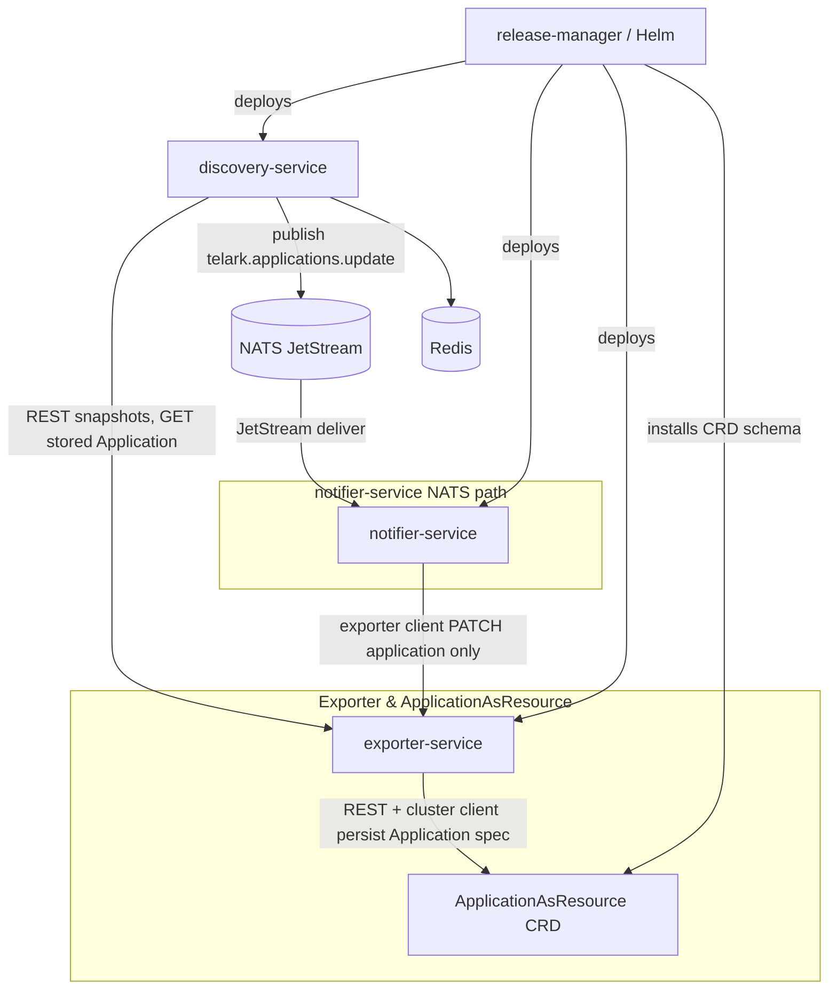
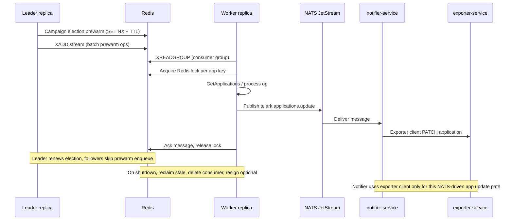
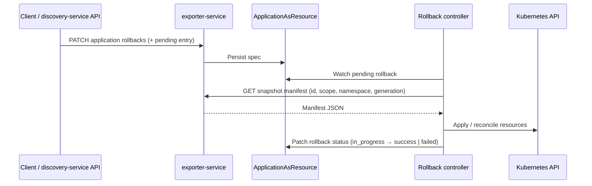

# Overview

Discovery Manager runs alongside your cluster: it discovers grouped applications, compares live state to the last persisted `ApplicationAsResource` spec, classifies diffs, records structured history, and stores filesystem snapshots of manifests. A separate rollback path applies a chosen snapshot back to the cluster under explicit intent and controller-driven status.

What sets it apart is the combination of **CRD-backed application identity**, **deterministic change classes and severity**, **pre-change snapshots** tied to history generations, and **multi-replica coordination** over Redis so discovery and prewarm stay correct at scale.

## Architecture

**discovery-service** discovers workloads from the cluster, builds `Application` models, and diffs them against the **last stored copy** it loads from **exporter-service** over REST. **Snapshots** are created by calling exporter’s snapshot API. The **ApplicationAsResource** CRD is defined once by Helm but **lives in the exporter domain**: exporter is the control point for reading and updating that resource’s spec on the cluster; **discovery-service** does not patch the CR directly.

**Redis** is used **only inside discovery-service** for coordination, not for application payloads. **Leader election** (`election:prewarm`) picks one replica to enqueue prewarm batches. A **Redis Stream** plus **consumer group** hands work to workers. **Per-app locks** (`lock:app:…`, `lock:enrich:…`) prevent overlapping prewarm or enrich runs. **Dedup** keys skip duplicate stream publishes in a cycle; **grace** and **incident-state** keys gate health-related changelog noise; **replica heartbeats** back stale-consumer cleanup. None of this carries full Application documents—that traffic is REST + NATS.

**NATS** (JetStream) is discovery-service’s **outbox** after diff/snapshot: each reconciled app is published on subject **`telark.applications.update`** (namespace prefix `telark`, resource group `applications`, action `update`). **notifier-service** subscribes to that stream and, **for application CR reconciliation only**, calls the **exporter HTTP client** to patch the stored application so **ApplicationAsResource** stays aligned—discovery-service never holds that subscriber or CR patch credentials; exporter remains the service that persists the CR.

## Core Concepts

**ApplicationAsResource**  
A namespaced CRD (`erpi.telark/v1alpha1`, kind `ApplicationAsResource`) whose `spec` mirrors the `Application` model: health, namespaces, resource inventory, Helm-style `managed` metadata, AI `insights`, `snapshots`, `rollbacks`, workload `metrics`, and `history` with a versioned `changeLog`. It is the durable source of truth **discovery-service** reconciles against and exporter patches.

**Change Detection**  
**discovery-service** compares the stored application (from exporter) to a freshly derived app from the live API: images, replica counts, health transitions, CPU/memory requests and limits (including metrics baselines), ports, env var keys, chart version, resource membership, and resource counts. Overlapping signals collapse into a single **changeClass** via priority rules (e.g. many simultaneous categories become **drift**). Supported classes in the CRD enum are **topology**, **deployment**, **scaling**, **resources**, **config**, **incident**, **recovery**, **rollback**, and **drift** (plus empty for legacy rows).

**Snapshots**  
On each material change, manifests for all workloads in the app are read from the **Kubernetes API** (dynamic client), server-managed fields stripped (same sanitization as apply-oriented manifest export), and written through exporter’s snapshot API. Entries in `spec.snapshots[]` record `generation`, `changeClass`, `severity`, `takenAt`, `id`, `namespace`, and storage `path`. Snapshots enable audit, comparison, and rollback targets.

**Rollbacks**  
Rollback is **intent-based**: a client appends a `rollbacks[]` entry (pending) on the Application CR via exporter. The in-cluster **rollback controller** picks up pending work, loads the manifest for the target snapshot from exporter, applies resources to the cluster, and advances status **pending → in_progress → success** or **failed**. **discovery-service** exposes a convenience HTTP trigger that validates the snapshot generation and patches rollbacks through exporter.

## Distributed Coordination

Redis backs **leader election** for prewarm enqueue, a **stream** of per-application operations, **per-app locks** for workers, **dedup** keys for batch cycles, **operation state** for observability, **scaling grace** and **incident state** strings for health gating, and **replica heartbeats** for consumer hygiene.

| Key pattern | Purpose | TTL |
|-------------|---------|-----|
| `election:prewarm` | Single writer for prewarm batch enqueue | Configurable (`COORDINATION_ELECTION_TTL_SEC`, default 120s in chart) |
| `streams:discovery:operations` | Operation stream (consumer group) | Stream retention (Redis / config) |
| `lock:app:{key}` | Serialize consumer processing per app | `COORDINATION_LOCK_TTL_SEC` (default 120s) |
| `lock:enrich:{id}` | Serialize enrichment for selector/namespace | Same lock TTL |
| `ops:{operationId}` | Serialized operation state | 300s (x-ware default) |
| `dedup:{app}:{cycle}` | Skip duplicate enqueue in a cycle | `COORDINATION_DEDUP_TTL_SEC` (default 60s) |
| `grace:scale:{app}` | Suppress incident noise right after replica changes | 90s (`GraceScaleTTL`) |
| `incident:state:{app}` | Redis-backed incident vs healthy for changelog dedup | 24h |
| `replica:{name}:heartbeat` | Detect dead stream consumers | 30s |

## Rollback Flow

## API Reference

Base path for both services: **`/api/v1/`** (rest-pkg `V1`).

### exporter-service — applications

| Method | Path | Description |
|--------|------|-------------|
| `POST` | `/resources/applications/create` | Create application resource. Request: application body. Response: created resource. |
| `GET` | `/resources/applications/get` | List applications. Response: list payload. |
| `GET` | `/resources/applications/{name}/get` | Get one application by name. Response: full `Application` including `history`, `snapshots`, `rollbacks`. |
| `PATCH` | `/resources/applications/{name}/patch` | Partial update. Request: JSON patch body. Response: updated resource. |
| `DELETE` | `/resources/applications/{name}/delete` | Delete application resource. |
| `GET` | `/resources/applications/{name}/rollbacks` | List rollbacks for the app. |
| `GET` | `/resources/applications/{name}/rollbacks/{rollbackId}` | Get a single rollback entry. |

### exporter-service — snapshots

| Method | Path | Description |
|--------|------|-------------|
| `POST` | `/snapshots/create` | Store snapshot payload. Request: JSON body (id, scope, namespace, generation, manifest). Response: snapshot metadata / path. |
| `GET` | `/snapshots/{id}/get` | Query: `scope`, `namespace`, `generation`. Response: snapshot blob / metadata. |
| `GET` | `/snapshots/{id}/manifest` | Same query params; `Accept` selects representation. Response: manifest for apply or inspection. |

### discovery-service

| Method | Path | Description |
|--------|------|-------------|
| `GET` | `/analyze/workloads/{namespace}/get` | List workloads in a namespace. Response: analyze payload. |
| `GET` | `/analyze/resources/{namespace}/get` | List resources in a namespace. Response: analyze payload. |
| `GET` | `/resources/applications/enrich` | Derive applications, run history diff, optional enrichment. Query: `namespace`, `selectorType`, `selector`, `insights`, `wait`, `waitTimeout`. Response: `applications[]`, totals. |
| `POST` | `/resources/applications/{name}/rollbacks` | Create rollback intent. Request: `{ "snapshotGeneration": number, "triggeredBy": string }`. Response: `{ "rollbackId", "status" }`. |
| `GET` | `/status/ready` | Readiness (503 until bootstrap / Redis ready when configured). |
| `GET` | `/status/live` | Liveness. |

## Change Classes

| Class | Trigger | Severity |
|-------|---------|----------|
| scaling | Replica count changed | medium |
| config | Env var keys added, removed, or changed (ports included in this path in the engine) | low |
| image-update | Container image reference changed (stored as **deployment** in API enums) | medium |
| resource-change | CPU/memory requests or limits changed | low |
| probe-change | Liveness, readiness, or startup probe changed (surfaced via workload baseline / resource drift) | low |
| mutation | Other field-level updates contributing to drift | low |
| incident | Health degraded or down | high / critical |
| recovery | Health restored after incident | medium |
| rollback | Snapshot applied to cluster (rollback change type) | low |
| drift | Multiple change categories in one detection window | medium |
| topology | Resource membership changed (add/remove tracked objects) | high |

*Priority resolution in code may return **topology**, **incident**, **recovery**, **deployment**, **scaling**, **resources**, or **config** before **drift** when a single category dominates.*

## Configuration

Shared (release-manager `common.sharedEnv` unless overridden per service):

| Env var | Description | Default (chart) |
|---------|-------------|-----------------|
| `REDIS_HOST` | Redis service host | `telark-release-redis-master` |
| `REDIS_PORT` | Redis port | `6379` |
| `SNAPSHOTS_MAX_VERSIONS` | Max snapshot entries retained per app | `5` |
| `SNAPSHOTS_SCOPES` | Snapshot scope config | `apps:true` |

**discovery-service** environment variables (`services.Discovery.env` in release-manager

| Env var | Description | Default (chart) |
|---------|-------------|-----------------|
| `APPLICATIONS_PREWARM_REFRESH_INTERVAL_SEC` | Prewarm scheduler interval | `31` |
| `COORDINATION_BATCH_SIZE` | Stream read count | `10` |
| `COORDINATION_BATCH_BLOCK_SEC` | XREADGROUP block | `2` |
| `COORDINATION_MAX_RETRY_ATTEMPTS` | Consumer retries per message | `3` |
| `COORDINATION_LOCK_TTL_SEC` | App / enrich lock TTL | `120` |
| `COORDINATION_LOCK_HEARTBEAT_SEC` | Lock renewal period | `30` |
| `COORDINATION_ELECTION_TTL_SEC` | Leader key TTL | `120` |
| `COORDINATION_ELECTION_RENEW_SEC` | Leader renew cadence | `15` |
| `COORDINATION_DEDUP_TTL_SEC` | Dedup key TTL | `60` |
| `COORDINATION_STALE_CLAIM_MIN_IDLE_SEC` | Stale message idle threshold | `300` |
| `COORDINATION_STALE_CLAIM_INTERVAL_SEC` | Reclaimer tick | `60` |
| `COORDINATION_SHUTDOWN_CLEANUP_TIMEOUT_SEC` | Consumer cleanup timeout | `45` |
| `REDIS_RETRY_INTERVAL_SEC` | Startup dial retry delay | `5` |
| `REDIS_MAX_WAIT_SEC` | Startup dial budget (`0` = unlimited) | `300` |
| `REDIS_PING_TIMEOUT_SEC` | Per-attempt PING timeout | `3` |
| `SNAPSHOT_WRITE_MAX_ATTEMPTS` | Snapshot write retries before blocking CRD update | `3` |
| `SNAPSHOT_WRITE_RETRY_INTERVAL_SEC` | Delay between snapshot write attempts | `2` |
| `HOSTNAME` | Pod name for consumer identity | Set by Kubernetes |

*NATS credentials and other secrets are typically injected via `envFromSecret` in the same charts.*
