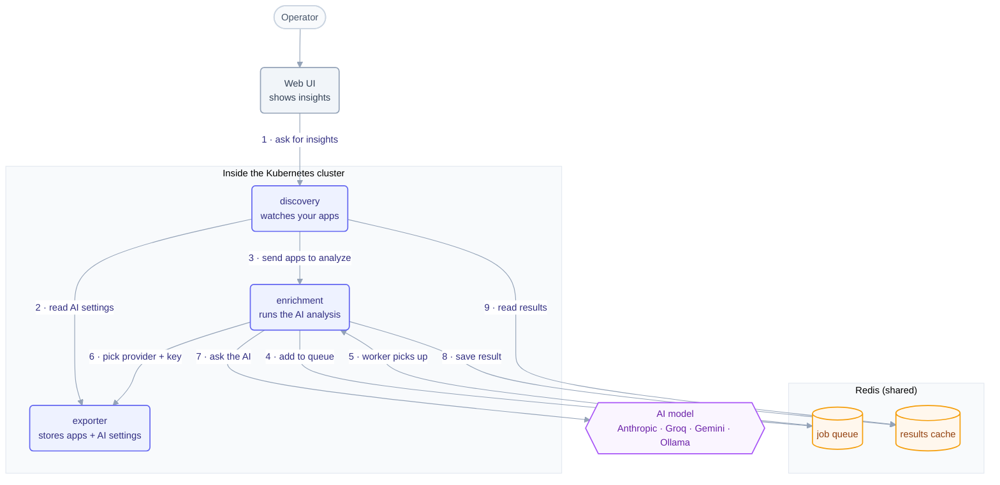

# AI Insights — How it works

Telark generates AI insights for each discovered app. This is a simple map of the
pieces and the order things happen in.

## Step by step

1. The **Web UI** opens an app and asks **discovery-service** for its insights.
2. On a timer (every 5 minutes), **discovery-service** reads the AI settings
   (is AI on? which provider?) from **exporter-service**.
3. If AI is on, it sends the current apps to **enrichment-service** to analyze.
   This just hands off the work — it does **not** wait for the AI.
4. enrichment-service drops each app it hasn't seen yet into a Redis **job queue**.
5. A worker picks up a job from the queue.
6. The worker looks up which AI provider and API key to use.
7. It asks the AI model to analyze the app.
8. It saves the answer into the Redis **results cache**.
9. The Web UI keeps polling discovery-service, which reads those saved results
   back from the cache and shows them.

The key idea: **sending work (steps 3–4) and reading results (step 9) are
separate.** The AI can be slow, but the UI never freezes waiting for it — results
just appear on the next poll.

## Notes for developers

- **Redis is shared** by discovery and enrichment on **DB 0** (auth uses DB 1).
  The job queue is the list `enrichment:jobs`; each result is cached under
  `enrichment:<namespace>:<name>`.
- **exporter-service is the only service that reads/writes cluster config** (the
  `GlobalConfig` CR). Both discovery and enrichment read AI settings through it —
  never from environment variables.
- The **timer is the only trigger.** (An older on-demand path existed but was dead
  code and has been removed.)
- Input `Signal` type lives in `internal/data/insights`; the result type
  (`Insights`) carries summary, tech stack, role, dependencies, confidence,
  category, risks (with severity), suggestions (with priority), resource
  efficiency, criticality, and tags.
- Each cached result records a prompt version. Editing the analysis prompt
  automatically refreshes stale cached results.
