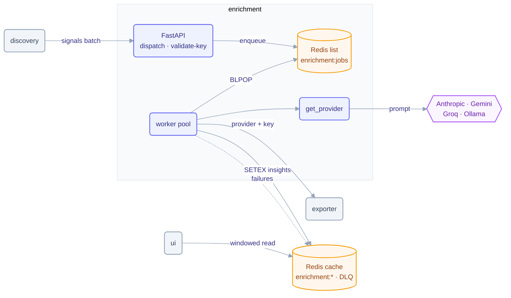

# enrichment service

AI insights over discovered applications. Enrichment is a Python / FastAPI service with
two halves: a thin **API** that accepts dispatch requests and validates provider keys,
and a **worker pool** that pulls jobs off a Redis queue, calls the configured LLM, and
caches typed insights for the UI. It never blocks discovery — dispatch enqueues and
returns; the model runs asynchronously.

## Architecture



## Flow

1. Discovery's leader tick dispatches a batch of application signals: `POST /api/v1/insights/applications`.
2. The API enqueues one job per application onto the Redis list `enrichment:jobs` and returns immediately.
3. Each worker `BLPOP`s a job, reads the active **provider + API key from the `GlobalConfig` CR via exporter** (cached, stale-tolerant — a transient exporter blip never flips a working provider off), and skips the job if a fresh cache entry already exists.
4. The provider returns a typed result (risk, suggestions, resource efficiency, criticality, tags), written with `SETEX` under `enrichment:*` (24h TTL). Repeated failures land in a dead-letter list.
5. The UI reads insights from a windowed scan of the cache — enrichment never calls the UI.

## Layout

| Module | Role |
|---|---|
| `main.py` | Worker pool: concurrent `BLPOP` loops, enrich, `SETEX` cache, DLQ, connectivity heartbeat |
| `api_server.py` | FastAPI app: dispatch, provider key validation, status probes |
| `providers/` | Provider factory + `anthropic`, `gemini`, `groq`, `ollama` implementations, plus `base`, `cache`, `config` |
| `provider_config.py` | Reads the active AI provider/key from the `GlobalConfig` CR (via exporter), cached |
| `enricher.py` · `insights.py` · `models.py` | Enrichment orchestration and the typed insight schema |
| `prompts/` | Versioned analyzer prompt templates |
| `authz.py` · `config.py` · `constants.py` | Authorization, env config, shared constants |

## Dependencies

- **Runtime:** Python 3.13+ (image ships 3.14), FastAPI, `redis`, `httpx`, provider SDKs (see `requirements.txt`).
- **Infrastructure:** Redis (job queue, insight cache, DLQ).
- **Peers:** receives dispatches from **discovery** (HTTP); reads `GlobalConfig` from **exporter** (HTTP + `SERVICE_TOKEN`); calls the external **LLM provider**.

## Configuration

Provider and API key are **not** env — an admin sets them at runtime from the UI and they
live in `GlobalConfig`. Only non-secret model names and worker tuning are env. Full
reference: [chart README](../../charts/telark/README.md#servicesenrichmentenv).

| Variable | Default | Description |
|---|---|---|
| `REDIS_POOL_SIZE` | `10` | Redis connection pool size |
| `NUM_WORKERS` | `3` | Concurrent workers (1 for ollama, 3 for cloud providers) |
| `OLLAMA_HOST` / `OLLAMA_MODEL` | `http://<release>-ollama:11434` / `qwen2.5:3b` | Local model endpoint + tag |
| `ANTHROPIC_MODEL` | `claude-haiku-4-5-20251001` | Claude model id |
| `GROQ_MODEL` | `llama-3.3-70b-versatile` | Groq model id |
| `GEMINI_MODEL` | `gemini-2.5-flash` | Gemini model id |

> The `provider/validate-api-key` endpoint also accepts a ChatGPT (OpenAI) key, but the
> worker pool only enriches with Anthropic, Gemini, Groq, or Ollama.

## API

- `POST /api/v1/insights/applications` — enqueue a batch of application signals (called by discovery).
- `POST …/provider/validate-api-key` — validate a provider key before it is saved to `GlobalConfig`.
- `GET /api/v1/status/{live,ready}` — probes.

## Build & run

```sh
python -m venv .venv && . .venv/bin/activate
pip install -r requirements.txt
python main.py                       # worker pool
docker build -t telark/enrichment:<version> .
```

Runs in-cluster via the [telark chart](../../charts/telark); see [INSTALL](../../docs/INSTALL.md)
and [CONTRIBUTING](../../CONTRIBUTING.md).
