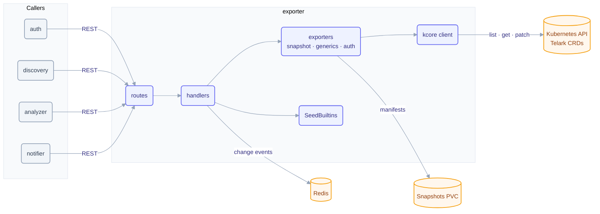

# exporter service

The platform's system-of-record. Exporter owns every telark custom resource, seeds
the built-ins, snapshots live cluster state to disk, and serves the REST API that all
other services call to read and write CRDs. It is the **only stateful service** — it
holds the snapshots PVC and is the single writer of Telark CRs on the cluster.

## Architecture



## Responsibilities

- Own the Telark CRDs (groups `erpi.*`, `auth.*`, `classification.*`) — the single service that reads and writes them on the cluster.
- Seed built-in resources (roles, categories, default `GlobalConfig`) on startup.
- Store and serve **snapshots** of workload manifests for audit, comparison, and rollback targets, on a PersistentVolume.
- Store and serve **protection plan reports** (rendered by discovery) and each plan's report ledger on a second PersistentVolume; a reports GC goroutine (own Redis lock key, one replica per tick, shares `SNAPSHOT_GC_INTERVAL_SEC`) sweeps report directories whose plan CR no longer exists.
- Expose the REST surface every other service consumes for CRD operations.
- Emit change notifications on Redis for downstream consumers.

## Layout

| Package | Role |
|---|---|
| `internal/routes` | HTTP route registration (rest router) |
| `internal/handlers/{resources,plans,classification,auth,notifications}` | Request handlers per CRD domain |
| `internal/exporters/{snapshot,generics,auth,shared}` | CRD read/write + snapshot serialization against the cluster |
| `internal/exporters/reports` · `internal/handlers/reports` | Report create/list/download, ledger get/put, reports orphan sweep |
| `internal/utils/artifact` | Generic on-volume primitives shared by snapshots and reports: atomic write, path containment, `TickAllowed` (Redis-gated GC tick) |
| `internal/utils/reports` | Reports store on the reports volume (per-plan directory, ledger, retention of 10 on-demand reports) |
| `internal/startup` | `SeedBuiltins` and boot wiring |
| `internal/managers/{envs,certs}` | Env resolution, CA-bundle / TLS material |
| `internal/redis/notifications` | Change-event publishing |
| `internal/cache` · `internal/utils/*` | Compute, concurrency, snapshot helpers |
| `internal/authz` | Per-route authorization requirements |

## Dependencies

- **Internal modules:** `data` (CRD types), `kcore` (dynamic informers / client), `rest` (router + server), `x-ware` (Redis, authz, CORS).
- **Infrastructure:** Kubernetes API (CRD storage), a snapshots **PVC**, Redis.
- **Peers:** none upstream — exporter is the backend the other services depend on.

## Configuration

Full reference: [chart README](../../charts/telark/README.md#servicesexporterenv). Key vars:

| Variable | Default | Description |
|---|---|---|
| `SNAPSHOTS_PATH` | `/snapshots` | Mount path for snapshot files |
| `SNAPSHOTS_PVC_NAME` | `<app.name>-exporter-snapshots-pvc` | PVC backing snapshot storage |
| `SNAPSHOTS_PVC_NAMESPACE` | `<app.namespace>` | Namespace of the PVC |
| `REPORTS_PATH` | `/reports` | Mount path for protection plan report files (the reports PVC) |
| `SNAPSHOT_GC_INTERVAL_SEC` | `3600` | Snapshot sweep interval; also drives the reports orphan sweep (`0` disables both) |
| `EXPORTER_K8S_CLIENT_QPS` / `_BURST` | `50` / `100` | K8s client rate limits, sized for CRD-write fan-out |
| `CA_BUNDLE` | configmap `<app.name>-ca-bundle` | Trusted CA bundle (`ca.crt`) |

## API

REST under `/api/v1/` — CRD operations grouped by domain: `resources/*` (applications,
groups, roles, users, globalconfig), `plans/*` (protection plans), `classification/*`,
`auth/*` (sessions, passkeys), `snapshots/*`, and `notifications/*`. Liveness/readiness
at `/api/v1/status/{live,ready}`.

Protection plan create/patch refuse (403) lifecycle, approval and material keys from
session identities; only Internal callers (discovery) may write them: `approvalMode`,
`approval`, `phase`, `renderedPolicies`, `startedAt`, `startedBy`, `terminatedAt`,
`terminatedBy`, `reason`, `health`, `healthCheckedAt`, `healthDetail`, `policies`, `scope` (including its nested
`exclusions`), `mode`, `timeMode`, `timeRange`, `name` (renames go through discovery's `update`, which keeps
names unique). This keeps approval (`pending_approval`) and phase changes
on discovery's gated routes.

Protection plan routes (`{id}` = plan name). Deny rules are `protection-plans.<action>.deny`
entries a custom role lists; built-in roles list none.

| Route | Authz | Purpose |
|---|---|---|
| `GET plans/protection/get` | Read, deny `viewprotectionplans` | List plans |
| `GET plans/protection/{id}/get` | Read, deny `viewprotectionplans` | Read one plan |
| `POST plans/protection/create` | Write, deny `createprotectionplan` | Create (discovery; sessions cannot send lifecycle or material keys) |
| `PATCH plans/protection/{id}/patch` | Internal | Patch the CR; users edit through discovery, which owns the lifecycle |
| `DELETE plans/protection/{id}/delete` | Internal | Delete the CR; users delete through discovery's `clear`, which removes deployed policies first |

Protection plan reports (`{id}` = plan name):

| Route | Authz | Purpose |
|---|---|---|
| `POST reports/plans/create` | Internal | Store a rendered report (called by discovery) |
| `POST reports/plans/{id}/ledger/put` | Internal | Replace the plan's report ledger |
| `GET reports/plans/{id}/ledger/get` | Internal | Read the plan's report ledger |
| `GET reports/get?planId=&trigger=&from=&to=&limit=` | Read (protection plans), deny `viewprotectionplanreports` | List report metadata across all plans, newest first. Optional filters: `planId` (repeatable or comma list), `trigger` (`manual`, `cancel`, `end`), `from`/`to` (RFC3339, on `generatedAt`). `limit` defaults to 200, max 1000; `X-Total-Count` holds the match count before the limit |
| `GET reports/plans/{id}/get` | Read (protection plans), deny `viewprotectionplanreports` | List the plan's reports |
| `GET reports/plans/{id}/download?report=&format=` | Read (protection plans), deny `downloadprotectionplanreport` | Download one report as `html`, `md`, `json` or `csv` |

Downloads carry `X-Content-Type-Options: nosniff` and `Content-Security-Policy: sandbox`, and are served inline (no `Content-Disposition`). Reports are removed when their plan is deleted.

Environment and tag categories (`plan-environments`, `plan-tags`) follow the `protection-plans`
scope: create needs Contributor (deny `addprotectionplancategory`), edit and delete need Owner
(deny `editprotectionplancategory` / `deleteprotectionplancategory`). For every category scope,
built-in categories cannot be patched or deleted and `type: built-in` cannot be set (400); a name
already used in the scope, compared trimmed and case-insensitively, is refused (409).

Applications and snapshots: `POST resources/applications/create`, `DELETE resources/applications/{name}/delete`,
`POST snapshots/create` and `DELETE snapshots/{id}/delete` are Internal (the notifier and discovery; users
delete an application through discovery's `reset`, which also purges its Redis state). Session callers of
`PATCH resources/applications/{name}/patch` may set only `displayName` (at most 200 characters) and
`description` (at most 1000); any other spec key answers 403 and an over-long value 400. Internal callers
keep full access.

Global config (`PATCH resources/globalconfig/patch`) is checked per field: `excludedNamespaces` and
`userSettings` need settings Contributor (deny `editdiscoveryconfig`), `snapshots` Contributor
(deny `editsnapshotstorage`), `ai` Owner (deny `controlaiinsights`), `oidc` Admin on `ALL` (deny `settings.editoidcconfig`),
and `cluster` is Internal (written by discovery). A value the CRD schema rejects answers 400 naming the
field, for example `invalid global config value for spec.ai.model`.

Users, groups and roles: creating a user with roles, groups or a status applies the same rules as
patching them (users Owner + `attachroletouser`, groups Owner + `addusertogroup`, users Admin +
`suspenduser`); attaching or removing a group's roles needs groups Owner plus `attachroletogroup` /
`removerolefromgroup` (a group create carrying roles is gated like an attach); a role create or patch may not grant a scope level above the caller's own on that
scope (an `ALL` grant counts for every scope), and a role whose `protection.preventModification` is set
refuses every patch. The same cap applies to assigning a role: a user create or patch and a group create or
patch answer 403 naming the role and scope when a role being added grants a level above the caller's own
(deny rules on that role do not count; roles already held or being removed are not checked). Adding a
member to a group, from the user or the group side, is capped the same way by every role the group
carries. A role patch touching `status`, `validity` or `scopesAndPermissions` is capped against the
merged role. Sessions may not set `type: built-in` or change `protection` on a role (403); deny rules
are stored lower-cased. `identities` on a user is Internal only, and `email` / `username` are changed
only by the account owner (403 otherwise; resending the stored value is allowed). Internal callers
are exempt.

Request bodies on the user, group, role, category and protection-plan create and patch routes must use
the exact JSON field names: an unknown or differently cased key (`AssignedRolesIDs`, `status.Phase`)
answers 400 before any guard or write runs.

Roles and groups on a user are diffed against the stored lists: an addition needs `attachroletouser` /
`addusertogroup`, a removal `removerolefromuser` / `removeuserfromgroup`, each with users or groups Owner.
A group's `assignedUsersIDs` is gated the same way (groups Owner plus the add or remove rule, never on
oneself). Ids that do not resolve to a live user, group or role answer 400 naming them, and lists are
deduplicated on write.

Group membership is stored on both sides and grants read only the user side, so the exporter keeps them
consistent: a group create or patch that changes `assignedUsersIDs` updates each affected user's
`assignedGroupsIDs`, and a user create or patch that changes `assignedGroupsIDs` updates each group's
member list. The counterparts are written first, one at a time under their own lock, and the caller's
own record last; a failure answers 500 with the record that could not be updated and the caller's
record unchanged, so the same request can be retried (every mirror write is a no-op once applied).
Affected users' cached grants are dropped. On boot, one pass over all users and groups aligns the
group side to the user side, which is what grants: a group gains the users that name it and loses the
ones that don't, and user lists lose duplicates and groups that no longer exist. Nobody's access changes.

Deleting a user (`DELETE resources/users/{id}/delete`) purges the user's sessions at once and, while the
cleanup finalizer still holds the record, the user grants nothing and `GET resources/users/{id}` answers
410, so peers resolving grants over HTTP deny as well. A user, group or role whose `deletionTimestamp`
is set grants nothing anywhere (`deletionTimestamp` is projected into the typed reads and the GET
responses) and refuses every PATCH from a session with 410; the cleanup cascade (service token) still
patches it. Finalizer removal and cleanup views of a record that is already gone answer 404.

A user's `email` is unique like the username (case-insensitive, trimmed): a duplicate answers 409.

Administrators (Admin on `ALL` through an active role, directly or via a live group) and bootstrap
accounts (`spec.bootstrap: true`, written only with the service token; a session sending the field gets
403) are hidden from every caller who is not an administrator or a service: the users list omits them,
`GET` by id, username, email or identity answers 404, group member lists and cleanup views omit their
ids, and roles-by-user answers 404. Such callers take the uncached path. Bootstrap accounts cannot be
deleted through the API, only they may edit their own record (any other caller gets 403), and a session
may not create or rename a user to an email listed in `BOOTSTRAP_ADMINS` (403). Another administrator
is deleted or suspended only by a bootstrap account (403 otherwise). Nobody may delete their own
account (403).

Snapshot reads (`GET snapshots/{id}/get` and `/manifest`) mask every `Secret` `data` and `stringData`
value with `[redacted]` for session callers; the stored file and Internal callers (the rollback
controller) keep the real values. Both routes are withheld by `viewapplicationsnapshotmanifest`.

## Build & run

```sh
go build ./...                 # from the repo root (uses go.work)
docker build -t telark/exporter:<version> .
```

Runs in-cluster via the [telark chart](../../charts/telark); see [INSTALL](../../docs/INSTALL.md)
and [CONTRIBUTING](../../CONTRIBUTING.md).
