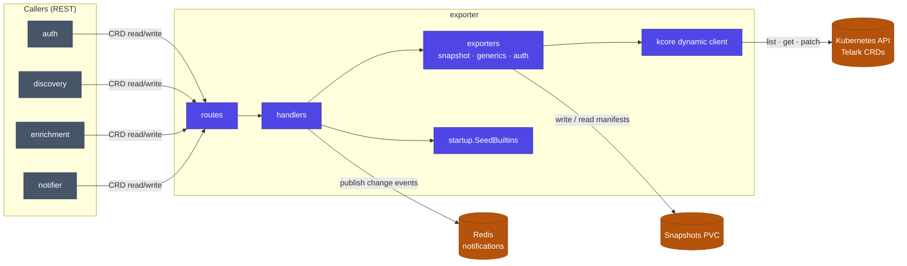

# exporter service

The platform's system-of-record. Exporter owns every telark custom resource, seeds
the built-ins, snapshots live cluster state to disk, and serves the REST API that all
other services call to read and write CRDs. It is the **only stateful service** — it
holds the snapshots PVC and is the single writer of Telark CRs on the cluster.

## Architecture



## Responsibilities

- Own the Telark CRDs (groups `erpi.*`, `auth.*`, `classification.*`) — the single service that reads and writes them on the cluster.
- Seed built-in resources (roles, categories, default `GlobalConfig`) on startup.
- Store and serve **snapshots** of workload manifests for audit, comparison, and rollback targets, on a PersistentVolume.
- Expose the REST surface every other service consumes for CRD operations.
- Emit change notifications on Redis for downstream consumers.

## Layout

| Package | Role |
|---|---|
| `internal/routes` | HTTP route registration (rest router) |
| `internal/handlers/{resources,plans,classification,auth,notifications}` | Request handlers per CRD domain |
| `internal/exporters/{snapshot,generics,auth,shared}` | CRD read/write + snapshot serialization against the cluster |
| `internal/startup` | `SeedBuiltins` and boot wiring |
| `internal/managers/{envs,certs}` | Env resolution, CA-bundle / TLS material |
| `internal/redis/notifications` | Change-event publishing |
| `internal/cache` · `internal/utils/*` | Compute, concurrency, snapshot helpers |
| `internal/authz` | Per-route authorization requirements |

## Dependencies

- **Internal modules:** `data` (CRD types), `kcore` (dynamic informers / client), `rest` (router + server), `x-ware` (Redis, authz, CORS).
- **Infrastructure:** Kubernetes API (CRD storage), a snapshots **PVC**, Redis.
- **Peers:** none upstream — exporter is the backend the other services depend on.

## Configuration

Full reference: [chart README](../../charts/telark/README.md#servicesexporterenv). Key vars:

| Variable | Default | Description |
|---|---|---|
| `SNAPSHOTS_PATH` | `/snapshots` | Mount path for snapshot files |
| `SNAPSHOTS_PVC_NAME` | `<app.name>-exporter-snapshots-pvc` | PVC backing snapshot storage |
| `SNAPSHOTS_PVC_NAMESPACE` | `<app.namespace>` | Namespace of the PVC |
| `EXPORTER_K8S_CLIENT_QPS` / `_BURST` | `50` / `100` | K8s client rate limits, sized for CRD-write fan-out |
| `CA_BUNDLE` | configmap `<app.name>-ca-bundle` | Trusted CA bundle (`ca.crt`) |

## API

REST under `/api/v1/` — CRD operations grouped by domain: `resources/*` (applications,
groups, roles, users, globalconfig), `plans/*` (protection plans), `classification/*`,
`auth/*` (sessions, passkeys), `snapshots/*`, and `notifications/*`. Liveness/readiness
at `/api/v1/status/{live,ready}`.

## Build & run

```sh
go build ./...                 # from the repo root (uses go.work)
docker build -t telark/exporter:<version> .
```

Runs in-cluster via the [telark chart](../../charts/telark); see [INSTALL](../../docs/INSTALL.md)
and [CONTRIBUTING](../../CONTRIBUTING.md).
