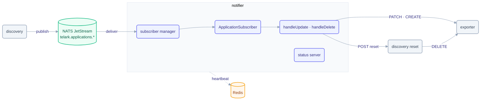

# notifier service

The notifier service keeps the `Application` CRs in step with what discovery sees. It consumes
the `telark.applications.update` events discovery publishes on NATS JetStream and upserts the
`Application` CR (`applications.telark.io`) through exporter's REST API. A `telark.applications.delete` message (nothing publishes one) calls
discovery's application reset, which clears the app's Redis state and deletes the CR and its
snapshot files through exporter. Discovery only publishes and exporter does the writes, so application identity stays
consistent under load.

## Architecture



## Responsibilities

- Subscribe to the `telark.applications.*` JetStream (creates the streams on start).
- On **update**: patch the named `Application` via exporter (`PATCH applications/{name}`); on `404`, create it (`POST applications`, upsert).
- On **delete**: reset the named application via discovery (`POST /api/v1/applications/{name}/reset`, authenticated with the service token). `200` and `404` (already gone) ack; a status the reset may later succeed on (`5xx`, `409`, no answer) is NAK'd for redelivery; any other refusal is acked and logged.
- Ack with structured logging; malformed messages are acked and logged, not redelivered forever.
- Expose a minimal HTTP status server whose readiness reflects live NATS connectivity.

## Layout

| Package | Role |
|---|---|
| `internal/subscribers/manager` | Creates streams, starts/stops subscribers, tracks connectivity |
| `internal/subscribers/applications` | The application subscriber: update/delete/unknown handlers |
| `internal/subscribers/base` | Shared subscribe/ack/execute lifecycle helpers |
| `internal/status` | Minimal HTTP status server (liveness/readiness probes) |
| `internal/constants` | Config keys, log/message strings |

## Dependencies

- **Shared packages:** `data` (Application types, messages), `rest` (applications client for exporter and discovery, router, server), `x-ware` (NATS core/streams, Redis).
- **Infrastructure:** NATS JetStream (subscribe), Redis (connectivity heartbeat).
- **Peers:** publishes nothing; consumes from **discovery** (via NATS), writes through **exporter** and resets deleted applications through **discovery** (via REST). No `kcore`: notifier never touches the K8s API directly.

## Configuration

Full reference: [chart README](../../charts/telark/README.md#servicesnotifierenv). Its one
service-specific variable is `NOTIFIER_APPLY_WORKERS` (default `8`), the concurrent apply workers; an
application always maps to the same worker, so its updates stay ordered. It inherits `app.shared.redis` and, when
`useNatsCreds: true`, the NATS consumer credentials from `<app.name>-nats-consumer-secret` (`NATS_USER` / `NATS_PASSWORD`).

## API

No REST business API. The status server serves `/api/v1/status/{live,ready}`; readiness
returns healthy only while the NATS subscriber is connected.

## Build & run

```sh
# from the repo root: the image builds the service together with internal/
go build ./services/notifier
docker build -f services/notifier/Dockerfile -t ghcr.io/telark/notifier:<version> .
```

Runs in-cluster via the [telark chart](../../charts/telark); see [INSTALL](../../docs/INSTALL.md)
and [CONTRIBUTING](../../CONTRIBUTING.md).
