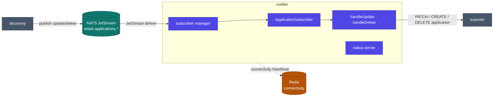

# notifier service

The event-driven reconciler for application state. Notifier subscribes to the
`telark.applications.*` NATS JetStream and persists each event to the
`ApplicationAsResource` CR **through exporter's REST API** — upsert on update,
remove on delete. This decouples discovery (which only publishes) from the single
CR writer (exporter), so application identity stays consistent under load.

## Architecture



## Responsibilities

- Subscribe to the `telark.applications.*` JetStream (creates the streams on start).
- On **update**: patch the named `ApplicationAsResource` via exporter; on `404`, create it (upsert).
- On **delete**: delete the named application via exporter.
- Ack every message with structured logging; malformed messages are acked-and-logged, not redelivered forever.
- Expose a minimal HTTP status server whose readiness reflects live NATS connectivity.

## Layout

| Package | Role |
|---|---|
| `internal/subscribers/manager` | Creates streams, starts/stops subscribers, tracks connectivity |
| `internal/subscribers/applications` | The application subscriber: update/delete/unknown handlers |
| `internal/subscribers/base` | Shared subscribe/ack/execute lifecycle helpers |
| `internal/status` | Minimal HTTP status server (liveness/readiness probes) |
| `internal/constants` | Config keys, log/message strings |

## Dependencies

- **Internal modules:** `data` (Application types, messages), `rest` (exporter client, router, server), `x-ware` (NATS core/streams, Redis).
- **Infrastructure:** NATS JetStream (subscribe), Redis (connectivity heartbeat).
- **Peers:** publishes nothing; consumes from **discovery** (via NATS) and writes through **exporter** (via REST). No `kcore` — notifier never touches the K8s API directly.

## Configuration

Full reference: [chart README](../../charts/telark/README.md#servicesnotifierenv). Notifier
has no service-specific env; it inherits `app.shared.redis` and, when
`useNatsCreds: true`, the `<app.name>-nats-secret` credentials (`NATS_USER` / `NATS_PASSWORD`).

## API

No REST business API. The status server serves `/api/v1/status/{live,ready}` — readiness
returns healthy only while the NATS subscriber is connected.

## Build & run

```sh
go build ./...
docker build -t telark/notifier:<version> .
```

Runs in-cluster via the [telark chart](../../charts/telark); see [INSTALL](../../docs/INSTALL.md)
and [CONTRIBUTING](../../CONTRIBUTING.md).
